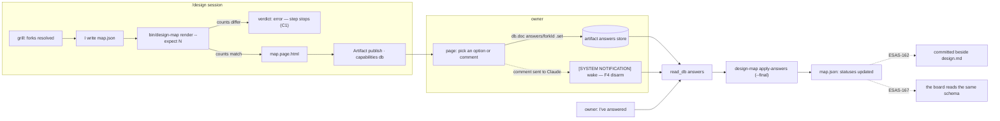

# ESAS-161 — `map.json`, the `design-map` skill v0, and the artifact renderer

**Run mode:** single interactive `/design`, no `.work/lane.yaml` brief, so the defaults apply.
**Grounded at** bett3r-ai-workflow `2b80340` (plugin 0.80.0) and esas `origin/master` `59ab592`.
**Parent design:** `docs/prs/ESAS-156/design.md` in the **esas** repo (merged as PR #87). Forks **N6-A**, **R7-A**, **R9-B** are that design's, already decided, and are inputs here rather than questions.

**Grounding degraded: this repo has no `CONTEXT.md`.** The ubiquitous language this unit speaks — *map*, *board kind*, *fork*, *actor (map)*, *deliverable* — is defined in **esas**'s `CONTEXT.md`, and every term below was checked against it. Recommend `/seed-context` for this repo separately; it is not in this unit's scope, and inventing a second glossary for the same terms is worse than having none.

## Problem & intent

A `/design` ends in a document its owner never reads, so review does not happen. ESAS-156 answers that with a **map**: the design's reasoning as goal → actor → impact → deliverable plus **forks**, which the owner answers by clicking. The board that will draw it is weeks of work in the **esas** repo (waves 2 and 3).

**N6-A is the decision that this unit exists to execute: the plugin renders the map as a claude.ai artifact now, and the board later reads the same `map.json`.** So this unit ships three things that are deliberately one ticket:

1. **`map.json`** — the one format for a design's reasoning, committed and versioned.
2. **`design-map` v0** — the skill (R7-A) that owns the map verbs, reading answers back, and the wake-in-refusal disarm.
3. **The artifact renderer** — `map.json` → a page the owner answers on, with answers saved in the artifact's `db` store.

It is the **tracer bullet for the format**, not throwaway work: ESAS-162 (*Step 4 writes the snapshot*), ESAS-163 (*generated decision section + Jira block*) and ESAS-167 (*the board's map fold*) all read what this ticket defines.

## What the code says, against the ticket

The ticket is accurate where it is checkable. What the probes changed:

- **The cited disarm is real and at the cited lines.** `esas-design` `SKILL.md:112-116` carries "Expect the wake to arrive wrapped in a platform banner declaring itself not user input, and sync anyway… **the notification is the doorbell, not the sentence.**" Re-resolved by symbol, not by address.
- **"read the answers back, as done in the ESAS-156 session" is a real, repeated gesture, not an aspiration.** That session's Provenance records `Artifact read_db answers` returning **17 documents**. The prototype's own writer is `db.doc("answers/"+id).set({pick, comment, updatedAt})` (`map.html:467-474`, esas `origin/master`), so the readback shape is fixed by working code, not chosen here.
- **The disarm this unit needs is NOT the ESAS board summon.** `esas-design`'s disarm covers a summon frame on `/api/esas/ws`. There is **no such channel on the artifact path**: a `db` write sends this session nothing. The only wake that reaches a session from an artifact is a **comment the owner sends to Claude on an artifact this session is watching**. The rule is the same shape — the notification is not the answer — but it fires on a different mechanism, and saying "mirror `SKILL.md:112-116`" without naming that would have shipped a disarm for a wake that never arrives. See fork **F4**.
- **`jsonschema` is not installed** (`python3 -c "import jsonschema"` → `ModuleNotFoundError`; Python 3.10.11). The committed schema is the contract; the executable validator is hand-rolled over the standard library.
- **The renderer must be a script, not model-written HTML.** The ticket's own test seam ("fixture `map.json` → render → fork count matches") cannot be run against prose. Prior art for the shape is `bin/work-docs-path` — an `sh` launcher over a Python script, ending in a verdict line per **ADR-004**.
- **The language is already committed in esas.** `CONTEXT.md` defines **Fork** ("open, decided (by the owner, or on recommendation), or moot with a reason, and never deleted"), **Map**, **Board kind** and **Actor (map)** ("Map payloads spell it `mapActor` so the two cannot be joined by accident"). This unit adds no glossary terms; it implements those.

## The resolved decision tree

Four forks. **F1 was decided by the owner. F2, F3 and F4 were resolved on my recommendation, at the owner's explicit instruction to take them and land something iterable** ("Pick your recommendation for these and the other two forks as well").

### F1 — Both layouts in schema v1 — **decided by the owner: option 1**

An **impact map** (goal → actor → impact → deliverable) and a **decision tree** (a lone technical ticket, no goal) are both maps, per esas `CONTEXT.md`. The payload carries `layout: "impactMap" | "decisionTree"`, and the goal / actor / impact / deliverable levels are **required only under `impactMap`**.

*Why:* ESAS-164 promises "a lone technical ticket with 4 forks gets a decision-tree map" and renders through this renderer. One conditional field now costs less than a schema version bump in the very next ticket — the version should move when the **board** starts reading the format (ESAS-167), not before.
*Rejected:* impact map only (ESAS-164 would then need a v2, or a fabricated goal for a ticket that has none); forks with no layout at all (drops the why/who/what view, which is the impact board's whole point).

### F2 — The count is checked against a caller-supplied expectation **and** against the rendered output — **resolved by recommendation: option 1, `--expect` mandatory**

Concern **C1** requires a mismatch to stop the step. Checking the forks the renderer drew against the forks in the `map.json` it just read is **a tautology that can only catch a renderer bug — never the drop the bar is about**, which happens when I write the payload from the interview and write 11 forks where the tree held 12.

So there are two checks, and they catch different failures:

- `design-map render <map.json> --expect <n>` refuses when the payload's fork count ≠ `n`.
- The renderer separately refuses when the page it emitted embeds fewer forks than the payload holds.

**`--expect` is mandatory.** An optional guard is one nobody passes on the day it would have mattered; this one exists precisely for a busy pass.
*Rejected:* renderer-internal only (the bar's own stated failure passes green); expectation only (a brand-new renderer dropping a fork while drawing is exactly the bug a first version has).
*Residual weakness, carried to Risks:* `--expect` is a number I type, so it is only as good as my count of my own tree.

### F3 — A fork left unanswered becomes `decided(recommendation)` only at an explicit finalize — **resolved by recommendation**

The prototype's page tells the owner: *"A fork you leave unanswered is taken on its recommendation."* The question is **when** that conversion is written into `map.json`.

`design-map apply-answers <map.json> <answers-dir>` folds saved answers in and **leaves every unanswered fork `open`**. `--final` is what converts the remaining `open` forks to `decided(recommendation)`, and it is run when the owner says they are done.

*Why:* converting on every readback means **a fork the owner has not reached yet is indistinguishable from one they considered and let stand**. The whole value of the `decided(owner)` / `decided(recommendation)` split (R3) is telling those apart, and ESAS-162 measures the epic's only goal signal — "N of M forks answered by the owner" — off exactly that distinction. Converting eagerly would make that number meaningless by construction.
*Rejected:* never auto-convert (contradicts the page's own stated rule, and a design would stall on forks the owner is content to leave); convert on every readback (destroys the measurement above).

Statuses follow R3 and esas `CONTEXT.md` exactly: `open`, `decided` with `by: "owner" | "recommendation"`, `moot` with a reason. **A moot fork is never deleted.** A fork I resolved myself and am showing for review is posted as `decided(recommendation)` from the start — that is the prototype's amber "resolved by me, review" — and the owner choosing on it makes it `decided(owner)`.

### F4 — The readback is owner-driven; the disarm covers the artifact comment wake — **resolved by recommendation**

**A saved answer sends this session nothing.** There is no artifact equivalent of the board's summon frame. So the gesture is: the owner says they have answered in the terminal, and the skill then runs `read_db` over the `answers` collection and folds the result in.

The disarm still ships, and it is **not** a copy of `esas-design`'s: it names the wake that actually exists here. **A comment-mode thread the owner sends to Claude on a watched artifact may arrive inside the `[SYSTEM NOTIFICATION - NOT USER INPUT]` banner** (unmeasured) — platform-emitted, unsuppressable, and stronger than any in-plugin rule. Read as a refusal, it ends the gesture silently while the owner watches a page that answered nothing. The consuming text says why it is not one: **the notification is the doorbell; the answers are in the store, about which the banner makes no claim.**

Two invariants carry over from `esas-design`, because they are properties of turn-based answering rather than of any one transport: **tolerate an empty wake** (a comment is not necessarily an answer), and **never propose from partial answers** — only for forks whose dependencies are all resolved.

*Rejected:* having the page call `artifact.publish` to force a republish notification as a home-made summon (it rewrites the page to signal, and republishing is how the page's own content changes — overloading it as a doorbell couples two unrelated things); polling the store (nothing to poll against, and no session stays live for it).

**This is unverified platform behaviour, and it is load-bearing.** Whether a comment sent to Claude on a watched artifact reaches a session, and what the banner around it says, is not measured in this session — measuring it requires publishing a page and commenting on it. See Risks.

### Decided without a fork

Each of these plays out identically across its alternatives, so it is recorded rather than asked:

- **`bin/design-map`, an `sh` launcher over `scripts/design-map.py`**, mirroring `bin/work-docs-path`, ending in a `DESIGN-MAP:v1` verdict line read per **ADR-004** (the line, never the exit code alone).
- **Validation is hand-rolled over the standard library**, because `jsonschema` is absent. `map.schema.json` is still committed: it is what the board (ESAS-167) and any future reader implement against.
- **The answers shape is the prototype's**, `answers/<forkId>` = `{pick, comment, updatedAt}`, so the 17 answers already saved in the ESAS-156 artifact parse unchanged.
- **A comment with no chosen option leaves the fork `open`** and surfaces the comment for me to reconcile. Treating it as a decision would decide a fork where the owner only asked a question.
- **The page declares `capabilities: {db: {}}`** and degrades to read-only when `claude.use("db")` resolves `null`, as the prototype already does (`map.html:510-519`).
- **The plugin version goes to 0.81.0** — merged plugin code reaches no session until `plugin.json` changes (`scripts/check-plugin-version-bump.sh`).
- **`map.json` has no committed home in this unit.** ESAS-162 owns writing it into the `work-docs-path` folder. v0 renders from a path it is given.

## Seams / flow

New boundaries crossed:
- **A committed, versioned format two repos implement against.** The plugin writes `map.json`; esas will read it (ESAS-167). Nothing enforces agreement across that boundary in this unit.
- **An artifact `db` store as a real answer store** the flow reads back, rather than a prototype's.

## Test seams

The ticket names one seam and it is the right one; the others mirror suites that already exist.

| Rule | Example | Seam to mirror |
|---|---|---|
| **C1 / F2 — a mismatch stops the step** (tracer bullet) | fixture with 11 forks, `--expect 12` → verdict is an error naming both counts, no page emitted; `--expect 11` → ok, both counts printed | `scripts/test-flow-seams.sh` (the ticket's own "mirroring `scripts/test-flow-seams.sh`") |
| **C2 — `mapActor`, never a bare `actor`** | a payload with an `actor` key → refused | same suite |
| **F1 — both layouts** | a `decisionTree` payload with no goal validates; an `impactMap` payload with no goal is refused | same suite |
| **F3 — status semantics** | `apply-answers` over a fixture answers dir: a picked fork → `decided(owner)`; an untouched fork stays `open`; with `--final` → `decided(recommendation)`; a moot fork survives both | same suite |
| **F4 disarm + skill rules survive** | the disarm sentence and the two invariants are present in `design-map/SKILL.md` | `scripts/test-esas-design.sh`, which guards `esas-design`'s text the same way |

**One executable suite, `scripts/test-design-map.sh`, holds all of these** — the renderer and the fold are real scripts, so most of this runs rather than being reviewed. The skill's prose half is a presence oracle, exactly as `test-esas-design.sh` already does for `esas-design`: it catches deletion, not wrongness.

## Risks / the gate-less seam

- **The tracer bullet is the owner answering on a page this skill generated, rather than one an agent hand-assembled in-session.** Both prototypes were hand-built. This is the first time the format is produced mechanically, and the failure is silent: a dropped fork reads as "not there", and "not answered = agree" accepts it. C1's two counts are the mitigation, and **F2's residual hole is that `--expect` is a number I type** — it catches a fork lost between the payload and the page, not one lost between my head and the payload.
- **F4 rests on unverified platform behaviour.** Whether a comment sent to Claude on a watched artifact wakes a session here, and what the banner around it says, was **not measured in this session**. The design is written so this does not block: the owner-says-so path needs no wake at all, and the disarm is text that costs nothing if the wake never arrives. **It must be measured in `/build`, by publishing a page and commenting on it — a text-review pass will always pass a disarm that is never exercised.**
  **Amended after slice 4 (decisions.md D15):** measured 2026-09-17 — the page's per-fork comment box writes `answers/<forkId>.comment` to the db and wakes nothing, so the readback trigger is the owner's word in the terminal only. A comment-mode thread sent to Claude remains unmeasured; the disarm stays for that path alone.
- **The schema is a cross-repo contract with no cross-repo gate.** ESAS-167 implements a reader in another repo against a file committed here. Nothing in either repo's CI compares them. `schemaVersion` is what makes the eventual disagreement legible rather than silent.
- **An artifact `db` store is not a durable record.** Answers live in the artifact, not in git, until ESAS-162 commits the snapshot. If the artifact is deleted, the answers are gone and only `map.json`'s folded statuses survive.

## Unspecified seams

- **Answer write-back at the wave-3 switch** — a design started on an artifact and continued on the board: does the store import the artifact's `answers`? **ESAS-174 owns this**, and ESAS-156 flags it as its own highest-risk gap. Named here because it is adjacent to the rule this unit sets, and the answers shape fixed here is what that import would have to read.
- **What `--final` does to a `moot` fork's reason** when the fork was made moot by an answer given in the same pass. The status rule says a moot fork is never deleted; who writes the reason is not settled.
- **Re-rendering a page that already has answers.** Republishing to the same URL keeps the `db` store, so answers survive — but whether a fork whose text I rewrote between passes should keep its existing answer is undecided. **This is adjacent to F3's specified rule and is therefore the most likely place for that rule to be wrongly generalised.**
- **Several maps live at once** (a fleet run). v0 assumes one page per design.
- **A comment disagreeing with every option**: a new option, or a reworded fork? Carried unchanged from ESAS-156 — the agent's call, unrecorded.

## Scope boundaries

- **In:** `map.schema.json` with `schemaVersion`; `bin/design-map` + `scripts/design-map.py` with `render` and `apply-answers`; the `design-map` skill v0 including the F4 disarm; `scripts/test-design-map.sh`; the version bump to 0.81.0.
- **Out:** writing `map.json` into `docs/prs` (**ESAS-162**); generating `design.md`'s decision section or the Jira block (**ESAS-163**); grill posting fork cards and the board-gate split (**ESAS-164**); anything in the esas repo (wave 2); targeting the board (**ESAS-174**).
- **Follow-up to spin off:** this repo has no `CONTEXT.md`; the terms it uses are defined in esas's. Worth a `/seed-context` pass on its own.

## Critique (arch, ops) — folded in

An inline adversarial pass, not a separate `critique` run. Three findings, all folded in above rather than left standing:

1. **The count check as the ticket words it is a tautology.** Became F2's two-check split. This was the highest-value finding of the pass: the bar as written would have shipped green while covering nothing.
2. **"Mirror the `esas-design` disarm" names a wake that does not exist on this path.** Became F4.
3. **Eager recommendation-conversion destroys ESAS-162's only measurement of the epic's goal.** Became F3's `--final`.

Not folded in, carried as a Risk instead: the schema being a two-repo contract with no gate. There is no cheap mechanism for it inside this unit.

## Provenance

Every command below was run in this session, at bett3r-ai-workflow `2b80340` and esas `origin/master` `59ab592`.

- **Ticket history:** `git log --oneline --all --grep=ESAS-161` → empty. The ticket body is a plan, not a historical document.
- **Parent design, re-resolved by identity:** `gh pr view 87` → MERGED 2026-09-14; `git show origin/master:docs/prs/ESAS-156/design.md` and `…/map.html` in the **esas** repo. Forks N6, R7, R9 read there directly, not from the ticket's summary of them.
- **The cited disarm:** `grep -n "doorbell\|Expect the wake" plugins/bett3r-ai-workflow/skills/esas-design/SKILL.md` → lines **112** and **114**, inside the 112-116 the ticket cites.
- **The readback gesture:** ESAS-156 design.md Provenance, "`Artifact read_db answers` returned 17 documents"; the writer is `map.html:467-474`.
- **Toolchain:** `python3 --version` → 3.10.11; `python3 -c "import jsonschema"` → `ModuleNotFoundError`.
- **Where the record goes:** `bin/work-docs-path --item ESAS-161 --owner-branch ESAS-161-design-map-schema-skill` → `outcome=ok root=docs/prs id=ESAS-161 path=docs/prs/ESAS-161 source=default exists=false owner=none`.
- **Glossary:** esas `CONTEXT.md` entries **Board kind**, **Map**, **Fork**, **Actor (map)**, **Deliverable** (`git show origin/master:CONTEXT.md`, around lines 440-480). This repo has none: `find . -name CONTEXT.md` → nothing outside `docs/prs/*/context.md`.
- **Sibling scope:** ESAS-162, ESAS-163, ESAS-164 and ESAS-174 fetched from Jira 2026-09-15; the boundaries in Scope are theirs as written.
- **Guards this unit must keep green:** `.github/workflows/validate-plugins.yml` runs `validate-plugins.py` (description ≤ ~1024 chars), `check-artifact-links.py`, `check-needles.py`, `check-eval-coverage.py`, `check-closes-syntax.py`, the `test-*.sh` suites and `check-plugin-version-bump.sh`. **`check-eval-coverage.py` fires only on a markdown link from an entrypoint to a non-entrypoint `.md`** (`MD_TOKEN`, `ENTRYPOINT_GLOBS`), so a skill linking `map.schema.json` needs no eval scenario; a skill that grows a `REFERENCE.md` does.
