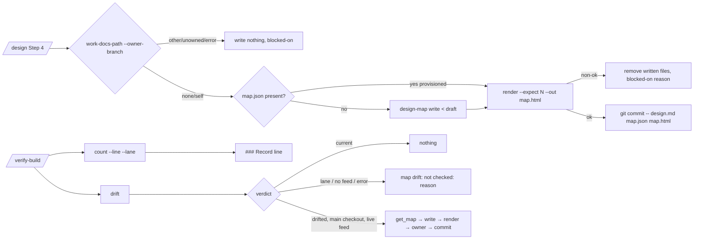

# ESAS-162 — the design map is committed beside the design, counted in the PR, and checked for drift

Ran under a lane brief (`.work/lane.yaml`, run `multi-ESAS-178-162-164-163-165-166-174`), stacked on ESAS-178 @ `c8e5036`. This is a **verification second pass** of the owner-approved resolved block (`design-multi:resolved:v2 … deps=ESAS-178`); the block governs and is not restated in full — only its decisions, the corrections verification found, and the seams it leaves open.

Grounding degraded: no CONTEXT.md for the plugin; grounded on the block, `commands/design.md`, `commands/verify-build.md`, `scripts/design-map.py`, `docs/prs/ESAS-178/decisions.md`.

## Problem & intent

A design's **map snapshot** (`docs/prs/<id>/map.json`, the answered decision map) must be committed in the same commit as `design.md` (with its rendered `map.html`), the PR must say how many forks the owner actually answered, and `/verify-build` must say whether the committed map has drifted from the live map feed — each as a script verdict, never agent prose.

## Resolved decision tree (from the block, verified at c8e5036)

| Fork | Decision | Verified |
|---|---|---|
| F1 map carriage in fleets | D+: provisioned `docs/prs/<id>/map.json` used as-is; `mapProvenance: lost` reported | holds — provisioner half is ESAS-166 |
| F2 drift without a feed | ship inert: `drift --no-feed` → `skip reason=no-map-feed` | holds — no esas feed in plugin |
| D1 one writer | every map.json byte via `design-map write`/`apply-answers`; map.html via `render --out` | holds — `write` exists (`VERBS`, `design-map.py:1377`) |
| D2 ownership | three files written only on `owner=none|self` | holds — `work-docs-path` owner verdict unchanged |
| D3 render before staging | `render --expect n --out map.html` first; non-ok → nothing written, `blocked-on reason=<r>`; one 3-path commit | holds — render refuses `not-grounded` (ESAS-178) |
| D4 count verb | `design-map count <map> [--lane <lane.yaml>] [--line]` | new; counting mirrors `decisions` (`design-map.py:1350`) |
| D5 drift verb | `design-map drift <map> (--feed-seq n | --no-feed)`, exit 0/1/2 | new |
| D6 compared seq | map's own `feedSeq` (schema `map-structure.schema.json`, optional int) vs the map-fold seq | holds |
| D7/D8 | refresh `--expect` = returned map's fork count; no board side effects | holds |

Rejected options are as recorded in the block (§1).

### Corrections found by verification (block kept, falsehood not asserted)

1. **Paths drifted.** Test suites and fixtures live at REPO ROOT (`scripts/test-design-map.sh`, `scripts/fixtures/design-map/`), and ADRs at root `docs/adr/` (max ADR-005). So: `scripts/test-design-snapshot.sh`, `scripts/fixtures/design-map/…`, `docs/adr/ADR-006-*.md`; `design-map.py` stays at `plugins/bett3r-ai-workflow/scripts/`.
2. **plugin.json bump is OUT** despite block §2/AC6: orchestrator directive (CAMPAIGN-PLAN §5) — the single bump is at `/merge-multi`. `check-plugin-version-bump.sh` fails on this branch deliberately.
3. **Drift attribute naming.** D5/D6 name the feed-side value `mapSeq`, but AC4 expects `mapSeq=none` when the *map file* lacks `feedSeq`. AC4 is the executable half and governs: in the `drift` verdict, `mapSeq` = the map file's `feedSeq` (or `none`) and `feedSeq` = the `--feed-seq` value (or `none` with `--no-feed`). The esas-side "mapSeq" of D6 is what the caller passes as `--feed-seq`. Recorded as a deviation for the PR.
4. The CI step for the new suite is added to `.github/workflows/validate-plugins.yml` (CI disabled; run locally) — collected by no local runner otherwise.

## Seams / flow

## Test seams

- AC1: `scripts/test-work-docs-path.sh` — extend `design_pass` (`design_pass()`, line ~510) with a real `design-map` against root fixtures: owner none → HEAD lists exactly the 3 files; other → nothing; `grounded:false` with forks → nothing written, `reason=not-grounded`; pre-placed map.json committed byte-identical.
- AC2–AC4: new `scripts/test-design-snapshot.sh` (style of `test-esas-design.sh`/`test-design-map.sh`, runs under sh/dash/bash) — count line fixture 2/1/1/1/0 → `2 of 5 forks answered by the owner (1 by code, 1 on recommendation, 1 open, 0 moot)`; `map: none`; lost provenance line; single-writer grep over `plugins/bett3r-ai-workflow/{commands,agents,skills}` with a planted positive control; drift matrix.
- AC5: `scripts/test-flow-seams.sh` presence rows for `design-map count`, `design-map drift`, `no-map-feed` in `commands/verify-build.md`.

## Risks / the gate-less seam

- The instruction text in `commands/design.md` Step 4 and `commands/verify-build.md` is prose an agent follows; only presence is tested. AC1 simulates Step 4 in shell, so the simulation and the prose can diverge — the tracer bullet is the count verb + Step 4 simulation together.
- Drift is inert until ESAS-167/169 (REACHABILITY-ONLY); no live `drifted` in this PR.
- Single-writer grep can false-positive on prose that *mentions* map.json; the grep targets write-shaped instructions (`> …map.json`, `tee …map.json`, `Write …map.json`).

## Unspecified seams (decided here, autonomously)

- `count` on a missing file **without** `--line`: `outcome=error reason=map-not-found` (exit 2). With `--line`: prints `map: none`, verdict `outcome=ok verb=count map=none`. With `--lane` whose `mapProvenance: lost`: prints the lost line regardless of the file (the lost state is the truer statement). The PR line precedes the final verdict line (ADR-004: verdict is last).
- `--lane` parsing: stdlib only (no yaml dep) — a line-anchored `mapProvenance: lost` match.
- `drift` on an invalid/unparseable map: `error` exit 2 with the validator's reason.
- `--feed-seq` non-integer: `error reason=bad-feed-seq`.
- Step 4 failure cleanup: files written this pass (map.html always; map.json only if Step 4 wrote it, never a provisioned one) are removed; a provisioned map.json is left untouched.

## Scope boundaries

In: block §2 minus the plugin.json bump. Out: Board mode, `start_map_session` (ESAS-164/174); map-tree (ESAS-163); Phase C/provisioner/`mapProvenance` writer (ESAS-166); esas reads (ESAS-167/169). ADR-006 claimed (allocation P9); ESAS-166 appends.

## Provenance

- `plugins/bett3r-ai-workflow/bin/work-docs-path --item ESAS-162 --owner-branch ESAS-162-lane` → `owner=none path=docs/prs/ESAS-162`.
- `git log --oneline --grep=ESAS-162` → empty (no prior shipping).
- `ls docs/adr` → ADR-001..005. `grep -n 'VERBS' plugins/bett3r-ai-workflow/scripts/design-map.py` → no count/drift.
- `python3 -c 'json.load(map.schema.json)$defs'` → forkStatusKind open|decided|moot; decidedSource owner|recommendation|code.
