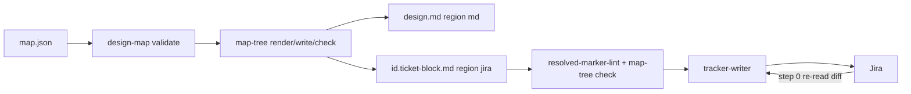

# ESAS-163 — decision text as a hashed, generated region of map.json

Run under a fleet brief (`.work/lane.yaml`, run `multi-ESAS-178-162-164-163-165-166-174`), stacked on ESAS-162-lane @ d395913.
The resolved-design block (`design-multi:resolved:v2 … deps=ESAS-178,ESAS-162`) is **authoritative**; this pass verified it at base. It is not restated here: the block in `.work/units/ESAS-163.ticket-block.md` / Jira ESAS-163 governs, and its D1–D9, F1–F3, scope, ACs (T1–T8) are the build contract. Grounding degraded: no plugin CONTEXT.md; the design-map `SKILL.md` glossary is the host.

## Problem & intent
Decision prose in `design.md` and ticket blocks is hand-copied from `map.json`, so a hand edit or an overturned fork diverges silently. `map-tree` renders a per-ticket projection of `map.json` into a **generated region** carrying `src=` (projection hash → stale) and `out=` (body hash → tampered), writes it deterministically, and callers (`/design` Step 4, `/verify-build` refresh, `/design-multi` fold-back, tracker-writer preflight) use it.

## Resolved decision tree
F1 = C (`status.source: code`), F2 = displace for md / refuse for jira, F3 = D+ — all decided(owner) 2026-09-16; see `map.json` (committed beside this doc) and the block for rejected options.

## Verification at base (d395913)
| Block claim | Probe | Result |
|---|---|---|
| `design-map validate` exists with verdict line (ESAS-178) | `grep -n verb=validate plugins/bett3r-ai-workflow/scripts/design-map.py` | holds |
| `decidedSource` includes `code` (ESAS-176) | `skills/design-map/map.schema.json` | holds (`owner, recommendation, code`) |
| fork has `tickets[]` (minItems 1), card optional, option `rejectedBecause`/`evidence`, moot `reason` | `skills/design-map/map-structure.schema.json` | holds |
| tracker-writer "decides nothing about content" `:14-16`, preflight `:23`, step 0 `:32-36`, budget `:38` | read `agents/tracker-writer.md` | holds |
| design-multi fold-back `:88`, template `:105-110`, marker note `:117` | read `commands/design-multi.md` | holds |
| test-flow-seams lint rows `:1123-1124` | read | holds |
| No `map-tree` at base | `ls plugins/bett3r-ai-workflow/bin` | holds |
| ADR-007 free | `ls docs/adr` → max ADR-006 (ESAS-162) | holds; ADR-007 claimed |
| Step 4 now commits design.md + map.json + map.html in one commit (ESAS-162) | `commands/design.md` Step 4 items 1–3 | holds; map-tree write inserts between render-ok and commit |

**Corrections / divergences:**
- Block scope says `plugin.json` bump and AC8 (`check-plugin-version-bump.sh` passes). Orchestrator directive: **do not bump**; AC8 will fail deliberately and is reported by name.
- Paths: tests and fixtures at repo root `scripts/`; `map-tree.py` and `bin/map-tree` under `plugins/bett3r-ai-workflow/`.
- `design-map` on PATH is the plugin cache (0.81.0) and lacks `write`; map-tree must call the **sibling launcher** (`<plugin>/bin/design-map`), never PATH.
- The block's D5 names `design.md` as the md target of `write`; a `design.md` has no region until inserted, so Step 4 uses `--insert-after "## Resolved decision tree"` on first write.

## Seams / flow

## Test seams
One new executable suite, `scripts/test-map-tree.sh` (T1–T8 per block §3, run under sh/dash/bash like `scripts/test-design-map.sh`), fixtures `scripts/fixtures/map-tree/`; wired into `.github/workflows/validate-plugins.yml` and the local gate mirror. Wiring presence in `scripts/test-flow-seams.sh`.

## Risks / gate-less seam
- Canonical hashing and region byte-splice: a splice that normalises bytes outside the region breaks AC2 invisibly — tracer bullet is `render` + `write`/`check` on md with T1/T2/T6.
- Block §6 risks carried unchanged (Jira-UI edits detected only at next write; unverifiable Jira `src=` after run-dir loss; wrong `tickets` attribution fresh-and-wrong; displaced prose visible not reconciled).

## Unspecified seams
- **E162-2 (routed here, verified applies):** a `/design` re-run on the same branch reuses its earlier `map.json` as-is (Step 4 item 1); with an equal fork count the stale map is committed. map-tree regenerates the region *from* that stale map, so it makes the stale decisions visible in `design.md` but does not detect them. Not handled here: telling a provisioned map from a self-authored one is the same map-only-folder owner rule escalated as E162-1 (ESAS-166). Escalated with recommendation.
- Insert position for `--insert-after` when the heading is absent → exit 2 `reason=heading-not-found` (build decides, recorded).
- Displace when the displaced heading already exists (second tamper): append a new dated section after the region end; never merge.

## Scope
In/out exactly as block §2, minus the plugin.json bump. Follow-ups: E162-2 (ESAS-166 owner rule).

## Provenance
`git rev-parse HEAD` = d395913; probes as in the verification table; `plugins/bett3r-ai-workflow/bin/work-docs-path --item ESAS-163 --owner-branch ESAS-163-lane` → `owner=none`; map written with `plugins/bett3r-ai-workflow/bin/design-map write` and rendered `--expect 3` → ok.
