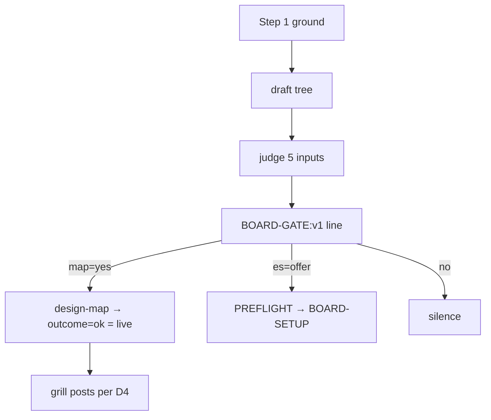

# ESAS-164 — /design gains a map gate; grill learns where a map is live

Run as a fleet lane (brief `.work/lane.yaml` present) — a **verification second pass** over the owner-approved `design-multi:resolved:v2` block (base 2b80340). This repo has no `.esas/`. Grounding degraded: no CONTEXT.md in this plugin repo; grounded on the command/skill files themselves and ADR-004.

## Problem & intent
`/design`'s only board gate is the eventstorming one, and its first sentence (`commands/design.md:18`, "skip this section entirely") exits before a map — which needs no `.esas/` — could ever be offered. grill's terminal list is also called "the map", colliding with the design map (ESAS-161/178). This unit: split the gates (map first, eventstorming second), make their combination an executable block printing `BOARD-GATE:v1`, teach grill the posting order where a map is live, rename grill's terminal list to "the tree", forbid lanes the map-posting tools.

## Resolved decision tree (all from the block, re-verified at BASE c8e5036)
- **E2=A** artifact counts as live map (`DESIGN-MAP:v1 outcome=ok`).
- **E3=A** grounding enforced; the refusal is ESAS-178's — verified present: `skills/design-map/SKILL.md:93` names `reason=not-grounded`; `map-structure.schema.json` has top-level `grounded`, `shape` (`mapShape`), fork `restsOn`, `testable: const false`. All E3/D4 sibling obligations on 178 are satisfied at base.
- **E4=B** one fenced `sh` combinator in `## Board mode`; args `open_owner_forks artifact_forks epic_parent lane esas_capable`; prints `BOARD-GATE:v1 map=yes|no shape=decision|impact|- es=offer|silent`. Rejected: prose+needles.
- **E5=A** grill keeps "decision tree", drops "map" for the terminal list (`grill/SKILL.md:24-40`; `esas-design/SKILL.md:53`). Rejected: "fork list", glossary-only.
- **D1** gate/grill never name `status`, `verbFamilies`, `capabilities`, `start_map_session`.
- **D2** map gate before eventstorming gate; no-`.esas/` exit becomes a silent no inside the eventstorming gate.
- **D3** epic parent → impact, lone ticket → decision.
- **D4** new `### Where a map is live` in grill (6 rules incl. "No fork card is posted before grounding", why/who exception, "title and what it waits on", "returns to the map only when its words change", `testable:false`).
- **D5** `lane=1` → map gate silent.
- **D7** `agents/design-lane.md` forbidden list adds `map_*` except `get_map`, `start_map_session`, rendering/posting/ingesting `design-map` subcommands.
- **D8** tests extend `scripts/test-esas-design.sh` (no new runner wiring).
- **D9** README sentence + ADR-008. **Divergence (recorded):** the block also says bump `plugin.json`; the orchestrator's brief (`preconditions`, CAMPAIGN-PLAN §5) says DO NOT — the single bump happens at /merge-multi. Followed the brief as an explicit run-level directive about release sequencing (not a design decision); `check-plugin-version-bump.sh` will FAIL deliberately on this branch.

Drift verified: `commands/design.md`, `grill/SKILL.md`, `esas-design/SKILL.md`, `agents/design-lane.md` unchanged since the block's base (brief `drift`); cited lines hold (`design.md:16/18/22/30`, grill `:24/:30/:36/:40`, test needles `:996/:1021/:1025`, helpers `assert_md`/`refute_md` now at `:626/:639`). `grep 'map gate|BOARD-GATE|map is live'` over plugin+scripts → 0 hits.

## Test seams
One seam: `scripts/test-esas-design.sh`. Prior art for block extraction: the PREFLIGHT marker extraction (`# --- esas preflight ---`, suite :131-135). Oracles AC1′ table, gate order, AC2′/D4/E5/D1/AC3 needles, per the block's "Done is verifiable by" 1-8.

## Risks / gate-less seam
Judged inputs can be misjudged; needles catch deletion only. The combinator block is the mechanical part — tracer bullet. The E5 rename must land atomically with its needles.

## Unspecified seams (non-guidance)
- How the model computes `open_owner_forks` vs `artifact_forks` beyond one sentence each — not specified; do not invent a counting procedure.
- Re-evaluating the map gate mid-design (the eventstorming gate re-asks per fork) — block silent; do not generalise "re-ask" to the map gate beyond stating the combinator is re-run when inputs change, if at all.
- design-map target selection — ESAS-174's; do not write it.

## Scope
In: `commands/design.md`, `skills/grill/SKILL.md`, `skills/esas-design/SKILL.md:53`, `agents/design-lane.md`, `README.md`, `scripts/test-esas-design.sh`, `docs/adr/ADR-008-*`. Out: `plugin.json` (brief), design-map skill/py, PREFLIGHT/BOARD-SETUP, Step 4, design-multi.md, plan.md, esas.

## Provenance
`grep -rn 'map gate\|BOARD-GATE\|map is live' plugins/bett3r-ai-workflow scripts` → none; `grep -n 'not-grounded' plugins/bett3r-ai-workflow/skills/design-map/SKILL.md` → :93; `grep -n grounded\|shape\|restsOn\|testable skills/design-map/map-structure.schema.json`; `ls docs/adr` → max ADR-005.
