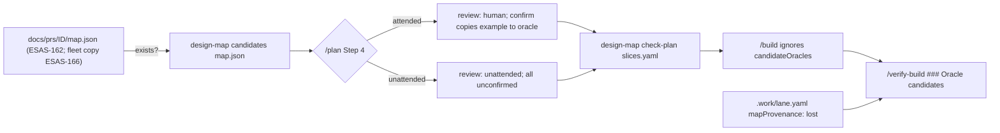

# ESAS-165 — /plan offers the map's decided walks as candidate oracles, never promotes them unattended, and /verify-build reports them

Ran under a lane brief (`.work/lane.yaml`, run `multi-ESAS-178-162-164-163-165-166-174`), stacked on ESAS-162-lane @ `d395913`. Verification second pass of the owner-approved block (`design-multi:resolved:v2 … deps=ESAS-178,ESAS-162`); the block governs and is not restated — only the decisions as they hold at base, the corrections, and the seams it leaves open. Brief `body` and `.work/units/ESAS-165.ticket-block.md` compared byte-equal (no divergence).

Grounding degraded: no CONTEXT.md for the plugin. Grounded on `commands/plan.md`, `commands/verify-build.md`, `skills/vertical-slicing/SKILL.md`, `scripts/design-map.py` (`fork_candidates`, `candidates`, `check_plan`), `scripts/worktree-pool.py` (`parse_slices`), `scripts/test-design-map.sh`, `docs/prs/ESAS-162/design.md`.

## Problem & intent

A resolved design map carries, per decided fork, the chosen option's **walks** — concrete scenario examples. `/plan` should offer them as **candidate oracles** for slices, but a candidate becomes a slice's `oracle` (the verifier's gate) only by a human's confirmation. Unattended, every candidate stays `unconfirmed` and `design-map check-plan` proves nothing was promoted. `/verify-build` then tells the reviewer what was and was not confirmed.

## Resolved decision tree (block, verified at d395913)

| Fork | Decision | At base |
|---|---|---|
| D1 program lists candidates | `design-map candidates` | **built by ESAS-178** (`candidates`, design-map.py:1201). Correction C1: the verb takes the map **positionally**; `--map` is refused (`unknown-flag-map`, test-design-map.sh:839). plan.md cites the positional form. |
| D2 which forks | chosen option's walks of decided forks (owner/recommendation/code); moot/open/nowalk/untestable counted | built (`fork_candidates`); `source: code` exists in map.schema.json, so the AC3 code fork is **kept** → `candidates=4`. |
| D3 where the mark lives | top-level `review:` + `candidateOracles:` after `slices:` | holds: `parse_slices` (worktree-pool.py) breaks at the first indent-0 line after `slices:`. AC5 proves it. |
| D4 writers | attended Step 4 confirms/rejects, confirm copies example into `oracle`; unattended → all `unconfirmed`, no copy; /build, executor, verifier ignore | prose in plan.md; `check_plan` enforces the unattended half. |
| D5 reader | `### Oracle candidates` after `### Slices` in verify-build's PR template, four forms, report-only | template now at verify-build.md:227 (block said :213; ESAS-162 grew `### Record`). |
| D6 location | `<path>/map.json` from `work-docs-path` `path=`; absent → no candidates, `review:` still written | holds (ESAS-162 places it there). |
| D7 attended display | per-slice oracle with its candidates, then unattached, "confirm, reject, or re-attach each candidate" | prose. |
| Fork 1 (E6) | A — unattended all `unconfirmed` | enforced by `check-plan reason=unattended-confirmed`. |
| Fork 2 (E7) | A — `testable:false` authored flag | built. |

### Corrections found by verification
- **C1** `--map` → positional (above).
- **C2 AC6 "candidates=0 with map.json missing".** `design-map candidates` on a missing file is a refusal, not `candidates=0`. So "no map" is decided by `/plan` *before* calling the verb: `/plan` tests `<path>/map.json` existence and does not call `candidates` at all. AC6 is tested as: a no-map `slices.yaml` (review, no `candidateOracles`) → `check-plan` prints `candidates=0`, plus a plan.md presence row for the existence check.
- **C3 AC3 fixture.** ESAS-178's existing `candidates.map.json` expects `skipped-untestable=2` (its zero-walk fork also carries `testable:false`; untestable wins). The block's AC3 counts (`skipped-untestable=1`, `skipped-nowalk=1`) need a distinct fixture: new `scripts/fixtures/design-map/plan-candidates.map.json`, exactly the block's 7 forks.
- **C4 check-plan leniency.** `check_plan` ignores `confirmed` candidates for the verbatim check (handed-down fact, design-map.py:1250). An attended confirm-copy therefore passes, as D4 intends.
- **C5 plugin.json bump**: in the block's scope, **not done** — orchestrator directive (the single bump is at /merge-multi). `check-plugin-version-bump.sh` fails deliberately.
- **C6 new suite wiring.** A new `scripts/test-plan-candidates.sh` is collected by nothing unless added to `.github/workflows/validate-plugins.yml` (additive step; CI is disabled, so this is record, not a trigger) and run by hand beside the orchestrator's gate mirror.

### Autonomous decisions (unspecified seams resolved)
- **U1 attended `/plan` also runs `check-plan`.** The block names it for the unattended branch only. Attended it is harmless (confirmed copies pass, C4) and catches an unconfirmed/rejected example copied into an oracle. Rejected: unattended-only — leaves the attended "copy without asking" risk entirely unchecked.
- **U2 check-plan fail handling.** On `outcome=fail`, `/plan` removes the offending copy and re-runs; it never writes/proceeds past a failing plan. Rejected: report-and-continue (the verifier would gate on an unconfirmed example).
- **U3 D5 precedence.** `mapProvenance: lost` (lane.yaml) → form 4; else no `candidateOracles` key → form 3; else `review: unattended` → form 1; else `review: human` → form 2. Independently, **`review: unattended` always prints "Breakdown not human-reviewed (unattended /plan)."** even with no map — the plan.md:55 promise predates maps. Rejected: forms strictly exclusive (would drop the not-reviewed mark whenever no map exists — the common case today).
- **U4 plan.md:55 wording.** Drop "whose slicing the human already reviewed"; a resolved block reviews the design, not the slicing — so a block-carrying ticket gets `review: unattended` when no human approves the breakdown.

## Seams / flow

## Test seams
- **`scripts/test-plan-candidates.sh`** (new; mirrors `scripts/test-design-map.sh`'s `check`/`attr` shape and `DM_SH`-style interpreter switch): AC1 count over `plan-candidates.map.json`; AC3 exact verdict + no moot id; AC2 `check-plan` over the existing `check-plan/{unattended-confirmed,candidate-in-oracle,conforming}.yaml` plus exit codes; AC5 `worktree-pool size` equal with/without trailing `review:`/`candidateOracles:`; AC6 no-map slices fixture → `candidates=0`.
- **`scripts/test-flow-seams.sh`** additive presence rows: plan.md names `candidateOracles`, the "confirm, reject, or re-attach" question, `check-plan` in the unattended branch, the map.json existence check; SKILL.md schema names `review:` and `candidateOracles:`; verify-build.md carries `### Oracle candidates` and all four D5 forms. Positive control row: a needle known present (`### Slices`) found, so a broken extractor cannot pass everything.

## Risks / the gate-less seam
- The whole `/plan` behaviour is model prose; only `check-plan` executes. **Tracer bullet**: the executable half — fixture + suite proving `candidates`/`check-plan`/pool-safety on the exact slices.yaml shape plan.md will document — so the prose is written against a proven shape.
- Paraphrased copies evade `check-plan` (accepted, block Risks).
- Stale candidates if the map is re-answered after `/plan` (accepted).
- Merge serialization: verify-build.md hunk is adjacent to ESAS-162's (we are stacked on it, so no contention); test-flow-seams.sh rows additive vs ESAS-163.

## Unspecified seams (non-guidance)
- How `/build` would react to a slice whose `oracle` was attended-confirmed from a candidate that later goes stale — not decided.
- Re-attachment semantics beyond setting `slice:` — not decided (no validator checks `slice` ids resolve).
- Whether `review:` should also be set by any command other than `/plan` — no.

## Scope
In: `commands/plan.md`, `skills/vertical-slicing/SKILL.md`, `commands/verify-build.md`, `scripts/test-plan-candidates.sh`, `scripts/fixtures/design-map/plan-candidates.map.json` (+ plan-candidates slices fixtures), `scripts/test-flow-seams.sh`, `.github/workflows/validate-plugins.yml` (one step). Out: design-map.py, map format, `/build`, esas, plugin.json (C5). ADR: none (P9).

## Provenance
- `git log --oneline --grep=ESAS-165` → 4b69032 (ESAS-178's candidates/check-plan commit, cites ESAS-165).
- `plugins/bett3r-ai-workflow/bin/design-map candidates scripts/fixtures/design-map/candidates.map.json` → `forks=8 candidates=4 skipped-open=1 skipped-moot=1 skipped-nowalk=1 skipped-untestable=2`.
- `grep -n '^###' plugins/bett3r-ai-workflow/commands/verify-build.md` → `### Slices` at 227.
- `grep -n "code" plugins/bett3r-ai-workflow/skills/design-map/map.schema.json` → `"code"` at :22.
- `work-docs-path --item ESAS-165 --owner-branch ESAS-165-lane` → `path=docs/prs/ESAS-165 owner=none`.
