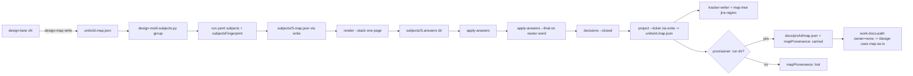

# ESAS-166 — design-multi answers on subject maps (verification pass)

Ran under a fleet brief (`.work/lane.yaml`, run `multi-ESAS-178-162-164-163-165-166-174`), base `ESAS-166-base @ 4fbf33f`. The ticket carries a `design-multi:resolved:v2` block; this is a second pass, not a fresh grill. Grounding degraded: no CONTEXT.md in this repo (glossary terms go to ADR-006's section).

## Problem & intent

`/design-multi` still asks the owner forks as canvas comments and prose; ESAS-178/162/163/164/165 built the map machinery (`design-map write|render --stack|project|decisions|apply-answers|count`, `map-tree`). This unit wires the fleet designer and the fleet provisioner to it: lanes emit **fragments**, Phase B groups them into **Subjects** (default: Jira epic link) answered on **Stacked maps**, every answer enters through `apply-answers`, `--final` closes the sitting, `decisions` generates the per-ticket record, and Phase C **projects** one map per ticket, which the provisioner **carries** into the lane worktree or reports as **lost**.

## Resolved decision tree (block D1–D11, Fork 1 = B, Fork 2 = D+) — verified at base

| Block item | Status at 4fbf33f | Evidence |
|---|---|---|
| D1 lane emits via `design-map write` | holds; to build | `agents/design-lane.md` names no `design-map` today (grep) |
| D2 epic grouping + seam proposals | holds; to build | no `parent:` in `commands/design-multi.md` step 0 |
| D3 `render --stack` order/byte-stable | **already shipped by ESAS-178** (D13) | `scripts/test-design-map.sh` "D6: render --stack" |
| D4 `subjects[]` + `subjectsFingerprint` | holds; to build (helper) | none in repo |
| D5 one answer path | holds; **names drift** | ESAS-178 shipped `apply-answers [--final]` and `decisions --closed`; `ingest`/`ingest --close` do not exist. Brief: "ESAS-178's names govern". |
| D6 maps replace canvas comments | holds; prose | design-multi.md step 4 |
| D7 `ticketRefs` on board target only | holds; prose only (`select`/`ticketRefs` are ESAS-174/177, absent at base) | `grep -n select scripts/design-map.py` → no verb |
| D8 :152 principle rewrite | holds; prose | |
| D9 no merge-multi refresh | holds; nothing to build | |
| D10 projection + provisioner copy + `mapProvenance: lost` | `project` shipped (178); `count --lane` already reads `lost` (162); **provisioner writer missing** | `grep mapProvenance agents/provisioner.md` → 0 |
| D11 stacking owned here | holds; prose | |

### Corrections to the block (the code wins)

- **C1 — verb names.** AC1/AC3/AC-text name `ingest`, `ingest --close`, `design-map select`. Built names: `apply-answers`, `apply-answers --final`, `decisions --closed`. The oracle rows name the built verbs. `design-map select` does not exist at base (ESAS-174 is *after* this unit, PW5): design-multi.md names it as the per-subject call with an explicit "until ESAS-174 ships `select`, the target is the artifact" fallback, and the AC2 presence row still requires the token.
- **C2 — AC1 verdict.** A count miss is `outcome=error`, not `fail` (ESAS-178 D13 house rule). AC1's stack-3-2-5 fixture asserts `error` and no page.
- **C3 — AC2 lane negative grep.** `agents/design-lane.md:22` must keep naming `map_*` MCP tools (ESAS-164 obligation) as *forbidden*. The negative grep is therefore scoped to instruction lines that invoke `design-map <verb>`: the lane names `design-map write`/`validate` and no `design-map render|apply-answers|project|decisions`.

### Escalations routed here, resolved in-design (engineering)

- **E162-1 → R1: `work-docs-path` reads a provisioned folder as `owner=none`.** Rule: the folder has no `design.md`, holds `map.json`, and that map's `mapId` equals the normalised item id (what `project --ticket` stamps) → `none`. Any other design-less folder stays `unowned`. Rejected: provisioner writes a stub `design.md` header — a fake design that readers (`/verify-build`, `/plan`) would find and treat as the record. Rejected: unconditional map-only → `none` — another item's map would be silently adopted.
- **E163-1 / E162-2 → R2: provenance decides reuse, not ownership.** The provisioner writes `mapProvenance: carried` (copied) or `lost` (run dir absent) into `.work/lane.yaml`; `carried` is already the fixture vocabulary (`scripts/fixtures/design-map/lane-carried.yaml`). `/design` Step 4 uses an existing `map.json` as-is **only** when the brief says `carried`; otherwise (single flow, or `lost`) a pass re-authors it through `write`. That closes the stale equal-count reuse for the single flow (and a `lost` lane), where every pass re-authors. In a lane with `carried` the map stays frozen by design (D9): `lane.yaml` keeps `carried` after the first `/design` commit, so a lane re-run reuses it as-is, and a fork-altering design change escalates to a `/design-multi` re-run rather than rewriting the map locally. Rejected: compare to HEAD — cannot tell a provisioned map from a self-authored one after the first commit.
- **ESAS-163 D7 → R3:** design-multi step 5's tracker-writer brief carries `units/<id>.map.json` per ticket. Applies (verified: `agents/tracker-writer.md` names no map path).

## Seams / flow

## Test seams

- `scripts/test-design-map.sh` — AC1 stack-3-2-5 (7 maps, drop → error no page); AC3 one-answer path (4 forks, 3 answers, `--final`, `decisions`; without `--final`, `decisions --closed` non-zero); AC5 projection filter (exists; add K-filter row on the new fixture).
- New `scripts/test-design-multi-subjects.sh` — AC4 grouping/fingerprint; must be added to `.github/workflows/validate-plugins.yml` and the scratchpad gate mirror.
- `scripts/test-work-docs-path.sh` — R1 rows (map-only matching mapId → none; mismatching → unowned).
- `scripts/test-flow-seams.sh` — AC2 presence rows (design-multi.md tokens, design-lane.md write/no-other-verbs, provisioner `mapProvenance: lost` and `carried`, verify-build lost line exists).

## Risks / the gate-less seam

The orchestrator steps are prose; only helpers and presence text are tested. The riskiest seam is R1: an owner rule change in `work-docs-path` that could let `/design` adopt a folder it does not own — it is the tracer bullet (smallest, fully testable, unblocks D+).

## Unspecified seams

- Seam-proposal *content* (which merges/splits to propose) — judgement; only the fingerprint over accepted proposals is mechanical.
- `ticketRefs` write mechanics — no `select`, no field at base; prose only.
- ADR-006 number/section merge order with ESAS-162 — amend in place, no renumber.

## Scope

In: design-multi.md (step 0 `parent:`, step 2 disk check, step 4 grouping/maps/:72-80, step 5 apply-answers/--final/decisions/project + tracker-writer map path, run.yaml schema, :152), design-lane.md Step 4 emit, provisioner.md copy + provenance, design.md Step 4 reuse rule (R2), work-docs-path rule (R1), grouping helper + tests + fixtures, flow-seams rows, ADR-006 section + glossary terms.
Out: design-map verbs (178), map-tree (163), `select`/board posting (174), `ticketRefs` field (177), multi-session (171b). **plugin.json NOT bumped** (orchestrator directive overrides the block's scope line).

## Provenance

- `git log --oneline --grep=ESAS-166` → only base merges.
- `bin/work-docs-path --item ESAS-166 --owner-branch ESAS-166-lane` → `owner=none`.
- `grep -n mapProvenance plugins/bett3r-ai-workflow/{scripts/design-map.py,commands/verify-build.md,agents/provisioner.md}` → reader and PR line exist, writer absent.
- `sed -n 40,60p docs/prs/ESAS-162/decisions.md` (E162-1/2), `docs/prs/ESAS-178/decisions.md` D13 (names), `docs/prs/ESAS-163/decisions.md:57` (D7).
