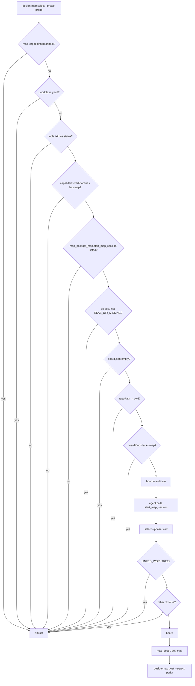

# ESAS-174: design-map selects its target (board or artifact) and checks board parity

Ran under `.work/lane.yaml` (fleet lane, stacked on ESAS-166-lane @ fd52c0f). The ticket carries a
`design-multi:resolved:v2` block that the owner approved on 2026-09-16. **This is a verification pass.**
The block's decisions D1-D10 and E17-E19 are authoritative and are not repeated here. This doc records
what was checked at BASE, what the block leaves unsaid, and the corrections.

Grounding: this repo has no `CONTEXT.md`. Grounding came from `docs/adr/`, the module header of
`design-map.py`, and `skills/design-map/SKILL.md`.

## Problem & intent

A design's map has two surfaces: the live esas board and the claude.ai artifact page. Which one to use
is decided by a **pure first-match table** (`design-map select`). Read-only probes run first. The one
side effect (`start_map_session`, which creates `.esas/`) happens only after every probe passes
(ADR-009, new). A design keeps the surface it started on (`target` pinned in `map.json`). Board parity
is proven by reading the store back (`design-map post`), not by comparing pixels.

## Verified at BASE (fd52c0f)

| Block claim | At BASE | Verdict |
|---|---|---|
| `select`/`post` do not exist | `VERBS` (`design-map.py:1460`) has no select/post | holds |
| `target` must be allowed in map.json (obligation on 178) | `map-structure.schema.json:18` `"target": {"enum": ["board","artifact"]}` | already shipped by 178 |
| `write` (stdin, validated) and `feedSeq` | `write` (`design-map.py:1274`), schema carries `feedSeq` | holds |
| ADR-009 is free | `docs/adr/` max is ADR-008 (ADR-006..008 taken by siblings) | ADR-009 claimed |
| `status` carries `capabilities.verbFamilies` on both outcomes | cross-repo esas@de920db:`packages/esas-mcp/src/handlers.ts:724-731` | holds |
| `map` family includes `start_map_session` | esas@de920db:`packages/esas-mcp/src/capabilities.ts` families.map | holds |
| `LINKED_WORKTREE` refusal, and also on "undetermined" | esas@de920db:`packages/esas-store/src/start-map-session.ts:48,88` | holds. **Seam:** a non-git dir is refused as `LINKED_WORKTREE reason=undetermined`, so row 9 fires for it too. That is acceptable (artifact) but the reason reads as linked-worktree. |
| `boardKinds` on board status | esas@de920db:`esas-store/src/board-endpoints.ts` `BOARD_KINDS` | holds |
| `bump plugin.json` (D8) | **Orchestrator directive: DO NOT BUMP** (CAMPAIGN-PLAN §5, one bump at merge-multi) | the block is overridden by the directive. The divergence is recorded as an escalation; `check-plugin-version-bump.sh` fails on purpose. |
| Verb names | 161/178 shipped `apply-answers`; error outcome is `error` | adopted |

## Decisions this pass adds (the block leaves these unsaid; the epic oracle constrains them)

- **P1: CLI shape of `select`.** The epic oracle already calls `select --phase probe|start --captures <dir>`
  (`scripts/oracles/epic-esas-156.sh:387,393`). So the inputs live in one **captures directory** with
  fixed file names, not in per-file flags:
  `tools.txt` (one MCP tool name per line; **file absent = no MCP in session**, row 2 also when `status`
  is not listed), `status.json`, `board.json` (absent or empty = board off), `start.json` (required for
  `--phase start`, else `outcome=error reason=missing-start`, exit 2), and an optional `pwd.txt`
  (logical and physical cwd, one per line; absent means the process's `$PWD` and `realpath`).
  `--map 
` is optional, for row 0. `--lane 
` overrides the lane file, which defaults to
  `.work/lane.yaml` under the cwd. Rejected: flags per file. They make the oracle's call spelling a
  second contract.
- **P2: the `probe` and `start` phases both re-evaluate rows 0-8.** `start` then applies rows 9-11. A
  stale probe can therefore never be promoted to `board`. `probe` returns `target=board-candidate` or
  `target=artifact`. Its `outcome` stays `ok`, which is what the oracle reads.
- **P3: `post` CLI.** `post --expect N --map <map.json> --readback <get_map.json>`. The verdict line adds
  `statuses=<sorted kind:source,...>` (source `-` for non-decided), an additive attribute the epic
  oracle reads (`epic-esas-156.sh:~411`). The parity multiset in D7 is (kind, source, reason, option).
  `statuses=` prints only kind:source, as the oracle expects.
- **P4: epic oracle corrections.** The oracle belongs to no unit, and the brief allows correcting it
  toward the shipped contract. Neither change weakens what it proves:
  - Stage 4: the region markers are `map-tree:v1` / `/map-tree:v1` (`map-tree.py:51-54`), not
    `map-tree:begin/end`. The awk ranges change; the out-of-region byte-equality assertion stays.
  - Stage 7: the call becomes `post --expect 5 --map "$S3FINAL" --readback "$CAPTURES/getmap.json"`.
    Captures come from `$ESAS_ORACLE_CAPTURES` when it is set. When it is unset, the oracle **produces
    real captures** from `$ESAS_CHECKOUT` with a committed capture driver
    (`scripts/oracles/capture-esas-156.mjs`). The driver uses the built `esas-mcp` over
    `InMemoryTransport`, the same entry point as esas's own oracle test, in a fresh `git init` tmp repo
    with no `.esas/`. It captures `listTools` → `tools.txt`, `status` (the dirmissing envelope with
    capabilities) → `status.json`, `start_map_session` → `start.json`, then `map_ground` +
    `map_post`/`map_choose` for stage 3's forks, then `get_map` → `getmap.json`. `board.json` is the
    board status body shape built from esas's exported `BOARD_KINDS` with `repoPath` = the capture
    repo. This is the one synthesized capture, because running a vite board in an oracle is out of
    proportion. `pwd.txt` names the capture repo.
  - If esas refuses the plugin's fork shape at `map_post`, **only because of E1** (esas MapFile
    structureVersion 1 vs plugin 2), stage 7 stays red with a named reason. It is recorded as the
    blocking cause, and the plugin's version is not changed.

## Resolved decision tree (summary; block §1 governs)

## Test seams

One seam: `scripts/test-design-map.sh` (already collected by the gate mirror and
`validate-plugins.yml`). The new cases follow the existing `check`/`attr` pattern over fixtures in
`scripts/fixtures/design-map/select/` (block §4 file list; capture dirs are assembled per case from those
files). AC1-AC8 of the block are the oracles, verbatim. Epic: `sh scripts/oracles/epic-esas-156.sh` with
`ESAS_CHECKOUT=/Users/tomasruiz/Documents/development/esas-int156-oracle` should exit 0. It is not a
per-unit gate, but the brief makes it this last unit's target.

## Risks / the gate-less seam

- **Supplier drift:** the fixtures copy the esas shapes by hand. Mitigation: stage 7's real captures.
- **E1 (structureVersion 1 vs 2):** this may make stage 7's `map_post` refuse. Tracer slice: build the
  capture driver early and learn this first.
- The SKILL.md prose (silence contract, D5 death-mid-sitting, D9 pinning) has no automatic gate. The
  verifier reads it against the block.

## Unspecified seams

- How the agent turns a live MCP session into the captures dir. SKILL.md describes it in prose. No
  script can read MCP.
- D5's "board still down at the next sync point" is not counted by any verb; it is prose only.
- A `board` pin re-probes, and a failure then goes to D5. No verb records a D5 fallback into `target`.
  Left unspecified (the block does not say whether a D5 fallback re-pins to artifact).
- Row 7's path comparison uses exact string equality on logical or physical cwd. No normalisation of
  trailing slashes.

## Scope

In: block §2 In list (design-map.py `select`/`post`, test cases + fixtures, SKILL.md section, ADR-009,
BOARD-SETUP.md graphless branch + `--non-anchor` launch line), plus P4 (oracle corrections + capture
driver). Out: block §2 Out list, and the `plugin.json` bump (directive).

## Provenance

- `grep -n VERBS plugins/bett3r-ai-workflow/scripts/design-map.py` → line 1460, no select/post.
- `ls docs/adr` → ADR-001..008.
- `sed -n 376,424p scripts/oracles/epic-esas-156.sh` → stage 7 call spelling.
- `grep -n map-tree:v1 plugins/bett3r-ai-workflow/scripts/map-tree.py` → markers at lines 51-54.
- esas: `git -C esas-int156-oracle rev-parse --short HEAD` → de920db; `capabilities.ts`, `handlers.ts:724-731`,
  `start-map-session.ts:48,88`, `packages/esas-mcp/oracles/epic-esas-156.oracle.test.ts`.
- Orchestrator measurement at fd52c0f: stages 1,2,3,5,6 ok; 4 error no-verdict; 7 error no-captures.
