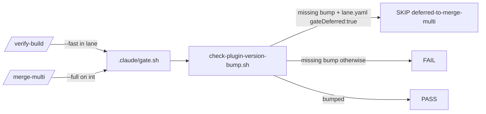

# ESAS-186 — a fleet lane's deliberately deferred version bump must not read as a red gate

Mode: single `/start` flow (no `.work/lane.yaml`). Design resolved by the owner 2026-09-17 ("yes, go for it"); this pass verified its cited facts against origin/master @ 9c835c0 — no grill.
Grounding degraded: no CONTEXT.md in this repo (grounded on ADR-001, the workflow file and script headers).

## Problem & intent
In a `/start-multi` fleet, plugin units deliberately leave `plugin.json` unbumped — they merge into `int/<run-id>` and `/merge-multi` does the single bump. But the release gate (`check-plugin-version-bump.sh`, job `version-gate`, step "Require a version bump for every touched plugin") FAILs them, and `/verify-build` Step 2 blocks on any FAIL, so every fleet PR opened over a named red step (esas campaign: plugin PRs #385–#391, int PR #392). The repo also has no `.claude/gate.sh`/`gate.mjs`, so lanes ran a hand-copied `validate-plugins.yml`.

## Verified facts
- `/verify-build` Step 2 (`commands/verify-build.md`): the `gateDeferred: true` lane bullet and "A `FAIL` blocks Step 6" — confirmed.
- `gateDeferred: true` is written into `.work/lane.yaml` by the `provisioner` (`agents/provisioner.md` "Write `.work/lane.yaml`") — confirmed.
- full-gate discovery order `.claude/gate.mjs` then `.claude/gate.sh`, `GATE-STEP:` contract, optional `GATE-MODE:` and final `GATE: PASS|FAIL <n> step(s)` — confirmed (`skills/full-gate/SKILL.md`).
- The fail-fast masking warning lives above the `version-gate:` job in `validate-plugins.yml` — confirmed (line numbers drift; located by the phrase "SEPARATE JOB on purpose").
- `merge-multi.md` Step 3 reads the gate but never mentions `lane.yaml`; integration runs without one — confirmed.
- plugin path `plugins/bett3r-ai-workflow/.claude-plugin/plugin.json`, version 0.81.0 on origin/master.

## Resolved decisions
- **D1** Committed host gate `.claude/gate.sh` running every `run:` step of `validate-plugins.yml`, same order, each independently (no fail-fast), emitting `GATE-STEP:` lines, `GATE-MODE:` and a final verdict. Modes `--fast`/`--full`/default. Plus a drift test: every `run:` command line in the workflow appears in the gate.
- **D2** Version step is lane-aware: `.work/lane.yaml` at the gated tree's root with `gateDeferred: true` turns a *missing bump* into `SKIP reason=deferred-to-merge-multi`. Everywhere else unchanged; CI has no lane.yaml.
- **D3** `verify-build.md`: one paragraph beside the gateDeferred bullet — expected SKIP, PR-body line, never bump in a lane.
- **D4** `merge-multi.md`: integration does the single bump; version step MUST PASS there; a deferred SKIP is refused.
- **D5** Tests (a)–(d) in `scripts/test-version-gate.sh` style + the D1 drift test.
- Rejected: bump in every unit; record as known baseline; teach /verify-build to ignore version FAILs.

### Implementation decisions taken this pass (autonomous)
- **A1 — where D2 lives.** In `check-plugin-version-bump.sh` itself, not only in the gate wrapper: the deferral is then testable by the existing oracle over throwaway repos, and the gate step stays a thin call. The script prints `SKIP reason=deferred-to-merge-multi` and exits 0 *only when it would otherwise have failed*; a bumped branch still prints its ✓ lines. `gate.sh` maps that marker to `GATE-STEP: version-bump SKIP reason=deferred-to-merge-multi`. CI is unchanged because the checkout never contains `.work/` (gitignored).
- **A2 — `--fast`.** This repo has no build/typecheck; `--fast` runs the cheap source-tree checks (validate-plugins, artifact links, needles, eval coverage, closes-syntax) plus the version step; the shell suites are SKIP in `--fast`. Default (no argument) = `--full` (the repo has nothing diff-scoped worth a middle mode); `GATE-MODE:` names it.
- **A3 — gateDeferred parse.** A line matching `^gateDeferred:[[:space:]]*true[[:space:]]*(#.*)?$`; anything else (false, absent, quoted) is not a deferral → FAIL stands.
- **A4 — interpreter matrix.** The gate runs each workflow `run:` block's lines verbatim (same dash/bash matrix); where `dash` is absent locally the line is reported as its own INCONCLUSIVE sub-step rather than silently dropped. The CI-only `apt-get install python3-yaml` line is not run locally (it is an installer, not a check) and is excluded from the drift test by name.

## Flow

## Test seams
- `scripts/test-version-gate.sh` (existing oracle, throwaway repos): cases (a)–(d).
- `scripts/test-gate-drift.sh` (new): every `run:` line of `validate-plugins.yml` appears in `.claude/gate.sh`; wired into the workflow and the gate.

## Risks / gate-less seam
- The SKIP can hide a real missing bump if a stale `lane.yaml` survives into a non-lane branch — mitigated by `/start` deleting residue briefs, and by `/merge-multi` refusing a SKIP.
- Drift test is textual; a reordering is not caught (order is a convention, not a correctness property here).

## Unspecified seams
- CI does not run `.claude/gate.sh`; it keeps its own steps (the drift test ties them).
- xp-layer / pv3-skills plugins get the same deferral semantics (the rule is per-tree, not per-plugin).

## Scope
In: gate.sh, drift test, D2 in the version script + oracle, verify-build.md & merge-multi.md paragraphs, plugin bump. Out: re-enabling CI, Jira transitions.

## Provenance
`git -C <wt> show origin/master:plugins/bett3r-ai-workflow/.claude-plugin/plugin.json | grep version` → 0.81.0; `grep -n gateDeferred plugins/bett3r-ai-workflow/agents/provisioner.md`; `grep -n 'lane.yaml' plugins/bett3r-ai-workflow/commands/merge-multi.md` → none.
