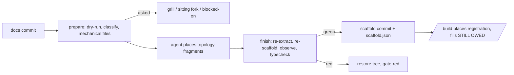

# ESAS-304 — Scaffold at the end of /design as its own commit; /build places and fills

Grounding: lane (unattended), verification second pass over a `design-multi:resolved:v2` block; `mapProvenance: carried`, so the owner's answers in `map.json` stand. No fork re-opened.

## Problem
/design ends in documents only; the ES layer stays in a gitignored design.json and scaffolding runs per slice in /build. So:
- a scaffolder block, which is a design question, fires in an unattended lane after the owner has left;
- nothing proves the agreed design compiles;
- agreed scenarios and observations have no committed path to tests and dashboards.

## Solution
/design gains Step 4b, the scaffold commit, after the docs commit. A new launcher, scaffold-commit, runs it.
1. prepare: needs designTooling.scaffold and designTooling.typecheck (skips loudly if either is missing); dry-runs the scaffolder with `--map docs/prs/<id>/map.json`; classifies blocks; writes the mechanical half (create-only files plus guarded barrel lines).
2. An agent places the topology fragments: new commands, new events and their schemas. It never places registration.
3. finish: re-extracts (designTooling.extract), re-runs the scaffolder so deferred units get written; runs designTooling.observe if declared, else prints "observe: none declared"; runs the declared typecheck. Green commits the files plus scaffold.json as "chore(<id>): scaffold the agreed design". Red restores the pre-step tree and ends gate-red; the docs commit stands.

Downstream: /build places registration and fills STILL OWED from the report; the verifier refuses pending scenario tests; an agreed scenario with no test warns on a fleet unit's PR and blocks at the integrated tree; the committed map.json carries scenarios, observations and coverage; a zero-fork /design commits a grounded map that says "Nothing to decide"; a fleet makes one scaffold commit, on int/<run-id>.

## User Stories
1. As the owner, I want the design to end with one green commit of everything derivable from what we agreed, so that I see it compile before anyone builds.
2. As the owner, I want design-question blocks asked while I am present, and gaps reported as STILL OWED.
3. As the owner, I want an element still questioned on the board held out of the scaffold.
4. As an executor, I want my slice's registration fragments and STILL OWED items handed to me from the committed report.
5. As the owner, I want an agreed scenario never to land untested, and stale untouched stubs cleaned up after a re-design.
6. As the owner of a ticket with nothing to decide, I want /design to say so on a grounded map and continue to /plan.

## Resolved decision tree

<!-- map-tree:v1 ticket=ESAS-304 gen=2 src=sha256:c2e4404db6f537d7f35a2cc421eded61444d187e264e0077676e8bdbe0c99463 out=sha256:dc76856633e8c456b2ffae8deb8915b77a7cc23c50134393b17abe82653b8e5d -->
`map-tree:v1 ticket=ESAS-304 gen=2 src=sha256:c2e4404db6f537d7f35a2cc421eded61444d187e264e0077676e8bdbe0c99463 out=sha256:dc76856633e8c456b2ffae8deb8915b77a7cc23c50134393b17abe82653b8e5d`
### ESAS-289-F3 — What the end-of-design scaffold commit contains when a design adds events or commands: Mechanical + placement: as A, then an agent in /design places topology fragments (new commands, events, their schemas; never registration), re-runs the scaffolder, and commits only if the repo's typecheck passes

decided(owner)

Why: Only B delivers 'one commit with all the scaffolding agreed' when a design adds events, which most designs do. The typecheck gate makes the agent's edit safe. A is the floor B builds on (the scaffolder stays create-only plus the barrel append, ESAS-292 and ESAS-300), so B costs one extra agent step in ESAS-304.

resolved_by: human

- Rejected — Mechanical only: create-only scaffolder + guarded EOF barrel append; any file that names a fragment-only symbol is deferred to STILL OWED for /build: no reason recorded
- Rejected — Leave it red: commit everything; the scaffold commit may fail typecheck and /build fixes it: Breaks the owner's stated bar 'the scaffold commit must build'.

### ESAS-304-F1 — ESAS-304 · What counts as 'agreed' on the eventstorming board for the design-end scaffold: Proposed and coherent, minus any element with an unresolved comment anchored on it

decided(owner)

Why: Expresses 'not agreed yet' with state the layer already has and no new BP work; held elements are visible in the report; B is the long-term answer to file if an explicit Accept gesture is wanted.

resolved_by: human

- Rejected — Everything proposed and coherent is agreed (today's planner semantics): no reason recorded
- Rejected — Explicit accept step on the ES layer (new design-layer state + op in BP, unowned in this run): no reason recorded

### ESAS-304-F2 — ESAS-304 · S-transport: how agreed scenarios reach the scaffold run

moot — merged into ESAS-306-F3: one carrier for scenarios AND observations: the committed MapFile export, read by --map

### ESAS-304-F3 — ESAS-304 · Where the scaffold commit happens in a fleet: One fleet scaffold commit: orchestrator dry-runs before the sitting, /start-multi step 0 commits on int/<run-id>, gated in baseGate

decided(owner)

Why: The only option where blocks surface while the owner is present and 'one commit of everything agreed' survives a fleet.

resolved_by: human

- Rejected — Each lane's /design scaffolds from its snapshot: no reason recorded
- Rejected — v1 is single-unit /design only; fleets keep per-slice scaffolding: no reason recorded

### ESAS-304-F4 — ESAS-304 · An agreed scenario with no test at landing: block or warn: Warn on unit PRs; block at the integrated tree (/merge-multi, or a lone unit's /verify-build)

decided(owner)

Why: An agreed example is a commitment and should block somewhere; the integrated tree is the first place every scenario's owner is present, and blocking a unit for a sibling's scenario is the wrong place.

resolved_by: human

- Rejected — Block every PR: every agreed scenario must map to a non-pending test in the branch: no reason recorded
- Rejected — Warn: PR body and /merge-multi list agreed scenarios with no test: no reason recorded

### ESAS-306-F3 — S-transport: how agreed observations reach the compiler: Committed map.json carries agreed observations (design-map projects them at /design Step 4); the compiler reads --map

decided(code)

Why: It is the only committed, lane-reachable design record that exists. It obliges ESAS-287 to give observations a structureVersion-2 home (schema bump plus PL copy).

resolved_by: code

- Rejected — The compiler reads the live store (get_map / readMap): Input is not reproducible outside the main checkout.
- Rejected — A separate committed observations.json per design folder: Two committed records of one design.
`/map-tree:v1`
<!-- /map-tree:v1 -->

## Implementation Decisions
- Launcher (new): `scripts/scaffold-commit.py` and `bin/scaffold-commit` (plugin dir), verbs prepare, finish (and finish --abort), census. Prints `SCAFFOLD-COMMIT:v1 verb= outcome=ok|skipped|blocked|gate-red|error` with counts (created, appended, placed, stillOwed, held, asked, stale, edited) and reason. Runs only declared commands.
- Report: `docs/prs/<id>/scaffold.json`, committed: final scaffolder JSON (HOSTED/APPENDED from ESAS-292, testPlan from ESAS-297), manifest[] {file, node, blob}, placed[], held[], stillOwed[], observe, input digests, baseSha. design.md gains a generated Scaffold section.
- Agreed = proposed and coherent, minus any element whose thread has an unresolved non-reaction comment (replies roll up to the root). Edges touching a held node are held; the compile-closure deferral keeps out anything referencing a held element.
- Blocks: asked (missing decision) goes back to the grill, becomes a sitting fork in a fleet, blocked-on in a lane; still-owed (no template) is reported and the commit proceeds. Until ESAS-297 gives a machine block code, every block is asked. deferred is never a block; after the re-run, a unit still waiting on a worklist fragment is a placement failure (gate-red), one waiting on a held or registration element is STILL OWED.
- Placement: the worklist is every non-registration fragment of a host file, placed as one compile unit (declarations and schemas, `.withCommands`/`.withEventReducers` entries, invariant wiring). Registration and test fragments stay for /build.
- Bar: the new `designTooling.typecheck`; both keys required, no framework default. On a red base, green means no error outside the base's error set. BP declares scaffold "pv3 g scaffold", typecheck "yarn typecheck" and tests; TS typecheck "yarn gate --fast" (ESAS-313); KX typecheck covering specs is owed. Census and ratchet guards are the named blind spot, listed in the report.
- Stubs and rollback: untouched means `git hash-object` equals the manifest blob; a re-run deletes untouched stubs then re-scaffolds; edited stubs are reported, never touched. prepare refuses a dirty tree; a non-ok finish restores tracked edits and removes new paths.
- Carrier: `skills/design-map/map-structure.schema.json` gains optional scenarios[] (derivedFrom walk and basis), observations[], coverage[] and an optional node description; new verb `design-map export-examples <map.json> --from <get_map.json>` carries agreed stored entries only, run by /design Step 4.1 and the /design-multi Phase C projection.
- Zero forks: `map-tree write` accepts a grounded zero-fork map and writes "Nothing to decide."; /design always writes grounded: true. The map gate prose states the tier rule (not enforced).
- /build Step 3.0: with a report, hand the executor the entries whose node is in the slice's designs: and run no scaffolder; without one, today's path is the permanent fallback. /plan adds the report's files to intended files. PV3 skill scaffold-from-design drops "at the START of any slice" and its framework default.
- Verifier check 4: RETRY when a delivered file declares a scenario test pending (`.todo(` on a title starting "<scenarioId>: "); TODO(scaffold) markers scoped to the slice's designs:; names scaffoldTodo(; /verify-build censuses blob-identical stubs.
- Landing rule: census reads the report's scenarioTests[] and unplaced[] by scenario id; anything not implemented warns in a fleet lane's PR body and blocks in a lone unit's /verify-build and in /merge-multi. Escape is a human strike.
- Fleet: design-multi gains Step 3.5 dry-run (asked blocks become sitting forks); start-multi step 0 runs prepare, place and finish on int/<run-id> before the base gate; the lane brief gains scaffoldReport; --map is repeatable.
- Small edits: lane-step-record folds into the step's last commit; the verdict gains gate-red; `test-work-docs-path.sh` learns scaffold.json; plugin version bumped (bett3r-ai-workflow only).

## Testing Decisions
- Oracle: new `scripts/test-scaffold-commit.sh` (plugin dir), `sh scripts/test-scaffold-commit.sh`; fixtures a stub scaffolder and typecheck plus a fixture agent. Cases: skipped, clean, asked, still-owed, held, red after placement (tree clean), unchanged re-run, rename, edited stub, census. RED at base (file absent).
- Seam 2: `scripts/test-map-tree.sh` and `scripts/test-design-map.sh`: grounded zero-fork write (today `reason=no-forks`) and `scenarios: []` validating (today schema-invalid).
- Tracer: TS with one event and one read model, after ESAS-289, 292 and 300: /design ends with the event placed and `yarn gate --fast` green.
- Riskiest uncaught: a placement compiling in the wrong module; placed[] gets reviewed.

## Risks
- Until ESAS-289, 292 and 300 ship, a real scaffold ends gate-red (the tracer shows it).
- Guards that glob new files (TS checkPolicyPlacement) are outside the typecheck.
- A placed event, once extracted, becomes a modify on rename, which is not planned; reported, not fixed.
- "Agreed = no open comment" is cosmetic for a team that never comments.

## Out of Scope
- Test generation (298, 299, 302, 303), placeholders (289, 300), new aggregates (292), dashboards (306), the session empty state (293).
- An explicit Accept op (rejected option); anchorless stored scenarios; the scaffolder release (ESAS-313).
- fog: which KX command typechecks emitted specs; whether /build hands the test-runner an expected todo count from the report (for ESAS-298).
- Unspecified seams: the scaffold commit's behaviour when design-multi's Phase C and a lane's /design both export examples; the PV3 `pv3 g scaffold --map` pass-through (ESAS-302).

ADR and glossary deltas (deferred to /build): plugin ADR-015 (reserved) covering the design-end commit, topology-only placement, the declared-typecheck bar, agreed = no open comment, one fleet commit, the landing rule; README glossary terms scaffold commit, scaffold report, untouched stub, held element, asked vs still-owed block, topology vs registration fragment.

## Provenance
- Verification at base 22b1f927 (PL): `map-tree check --map docs/prs/ESAS-304/map.json --ticket ESAS-304 --dialect jira <block>` -> fresh, 6 forks, 0 open, 1 moot.
- `grep -n no-forks plugins/bett3r-ai-workflow/scripts/map-tree.py` -> :367 (the zero-fork refusal still stands).
- `grep -c 'scenarios\|observations' skills/design-map/map-structure.schema.json` -> 0 (carrier absent at base).
- `ls plugins/bett3r-ai-workflow/scripts | grep scaffold` -> none (oracle and launcher absent).
- Drift: block cites by PL@0337f8a6 line numbers; symbols re-found (lane-step-record fold at lane-step-record.py:169, build.md Step 3.0, verifier check 4); `test-work-docs-path.sh` is not under plugins/.../scripts at this base, its location is re-found at build time.
- Answers: the carried `docs/prs/ESAS-304/map.json`.
