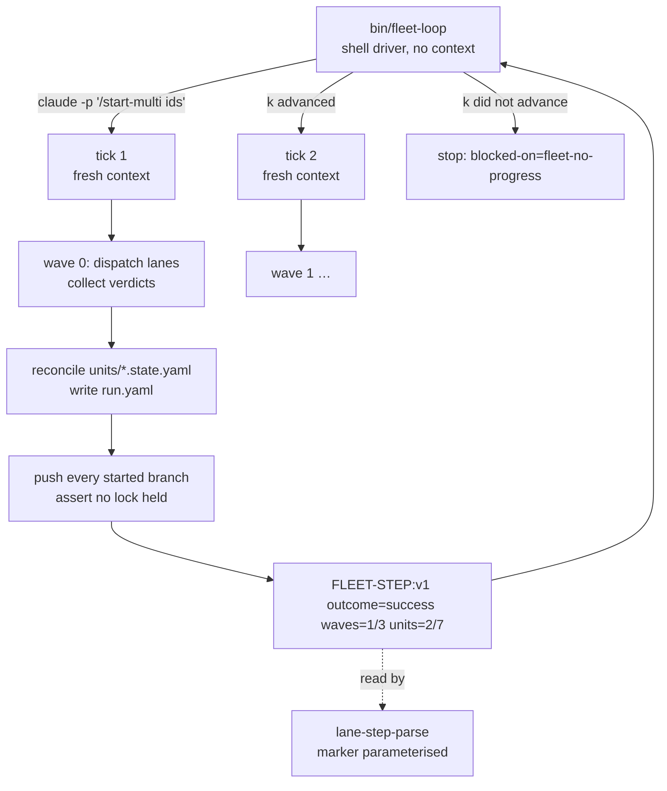

# Design — gh-429: fleet orchestrators yield at wave and phase boundaries

> **Grounding degraded: this repo has no `CONTEXT.md`.** Grounding fell back to `docs/adr/` and the
> command and agent bodies, which in this repo are the source. Recommend `/seed-context`.
>
> Run without a lane brief (no `.work/lane.yaml`): a single interactive `/design`. No `.esas/` → no
> board. Issue: [#429](https://github.com/bett3r-dev/bett3r-ai-workflow/issues/429). Base:
> `624a569` on `flow/thin-context-rewrite` (PR #428, unlanded at design time).

## Problem & intent

After [ADR-012](../../adr/ADR-012-artifacts-carry-rules-the-ledger-carries-evidence.md) every *lane*
context is bounded. One term is not. A **step** runs in a `step-lane` that ends on its verdict line.
A **unit** runs in a `unit-lane` holding five dispatches, five verdicts and a state file. The
**orchestrator** — `/start-multi`, `/design-multi`, `/merge-multi` — is one context for the whole
run: every dispatch, every child-completion notification and its own reasoning, growing with the
number of unit events, at a cost quadratic in its own turn count. ADR-012 thinned its command body
(per-turn cost) and changed nothing about its length.

The intent is to apply `/build`'s move one level up. State on disk is already the primary source, so
the orchestrator can **end** and be re-dispatched on a fresh context. Per-tick context is then
bounded by one wave rather than by the fleet.

**Nothing here is exponential.** Growth in any single context is linear per turn and cost is
quadratic in turns. Old fleets felt exponential because three multipliers stacked: inline command
bodies in the unit-lane, unbounded polling turns, and no context that ever ended on purpose. Two are
gone; the orchestrator is the third.

### What the evidence pass changed

The issue body was transcribed from a handoff that declared its own measurements expired. Verifying
it against the branch corrected three claims and produced one decision the issue did not contain.

- **`outcome=yield` has nowhere to land.** `OUTCOMES` in `remote-ai-agents/src/scheduler/verdict.ts:109`
  is exactly three values; anything else returns `exitClass: 'infra'` with `infraReason:
  'unknown-outcome'`. And `/build` already spells a yield without a fourth word — `unit-lane.md:64`:
  "a `success` whose `slices=` is short of its total."
- **The stated reason for rejecting a reused `LANE-STEP` names the wrong mechanism.** `verdict.ts:156`
  compares `step` against `expectedStep` — the step the scheduler *leased* — and holds no enum at
  all. `lane-step-parse.py` enforces no enum either; what it does pin is the marker token itself
  (at the design's base, `git show d04a3cd:plugins/bett3r-ai-workflow/scripts/lane-step-parse.py` line 64,
  `TOKEN = re.compile(r"LANE-STEP:v(\d+)…")` — slice 1 replaced that literal with an interpolated
  `--marker`, so no `TOKEN` symbol exists at HEAD). So "its regex is already
  generic" is half true: the attribute grammar accepts `waves=k/N` unchanged, the marker name does not.
- **The wave boundary is not new.** `start-multi.md:52` already defines a **cost stop** there, and
  states the safety half the proposal omitted: "`git push` every started lane's branch first and keep
  its worktree, because a lane that has not reached `/verify-build` has pushed nothing."
- **New fork (F4).** `waveBudget`, `wavesDone` and `phase` are not one decision. `units[].wave` plus
  `step`/`status` already determine wave progress (`start-multi.md:114`), and `/design-multi`'s
  `units[].step` (`pending|drafting|critiqued|resolved|written|done`, `design-multi.md:126`) *is* the
  phase. The command itself names the hazard of storing them anyway — `start-multi.md:73` at the base,
  now `start-multi.md:112`: "Git is the
  primary signal and the state file a hint", with "a state file that says `step: plan` while the
  branch carries three slices" called the orchestrator's commonest misread (its canonical home is `agents/unit-lane.md:74`).

## Resolved decision tree

<!-- map-tree:v1 ticket=GH-429 gen=1 src=sha256:24e3e72f52dfbca61f2998c98fff2b804843b6e33468f2676b49ec2de21cb0ae out=sha256:5e5721b2f80b636617a54a827e0b7f40a34a6565777fcbc7fa07ce98164eebb8 -->
`map-tree:v1 ticket=GH-429 gen=1 src=sha256:24e3e72f52dfbca61f2998c98fff2b804843b6e33468f2676b49ec2de21cb0ae out=sha256:5e5721b2f80b636617a54a827e0b7f40a34a6565777fcbc7fa07ce98164eebb8`
### GH-429-F1 — Where the orchestrator's yield sits: Wave completion, and push every started branch first

decided(owner)

Why: /start-multi already defines a cost stop at exactly this boundary and already says what it costs to stop there: 'git push every started lane's branch first and keep its worktree, because a lane that has not reached /verify-build has pushed nothing.' A is that stop with the safety half dropped.

- Rejected — Wave completion only: the same boundary with the safety half dropped: it leaves a gate-red lane commits only in its worktree, so the run cannot move machines and a recycled worktree loses them (commands/start-multi.md:52, commands/start-multi.md:97)
- Rejected — Any time, with lanes as detached claude -p processes: premise unverified: whether a claude -p exit kills its background subagents is a known-unknown; take it only if B's per-wave context still measures too large (agents/unit-lane.md:21-40)

### GH-429-F2 — Who re-dispatches the orchestrator, and what stops a driver looping forever: A shell driver (bin/fleet-loop)

decided(owner)

Why: it is the only option that keeps the unattended contract while ending the context, and the guard it must carry is already specified and proven one level down in unit-lane's /build loop

- Rejected — The human re-invokes each tick: breaks the unattended contract the command states in its first line
- Rejected — /loop inside one session: it re-creates the unbounded context this work exists to remove

### GH-429-F3 — How a yield is spelled in the verdict line: New marker FLEET-STEP:v1, reusing the three outcomes; a yield is success with waves=k/N short of total

decided(owner)

Why: it is the only option that adds a marker without adding a vocabulary. The correction that drives it: the blocker on C is verdict.ts's expectedStep lease, not a step= enum, and the blocker on A is the three-value OUTCOMES table, which the issue attributed to the wrong place.

- Rejected — New marker FLEET-STEP:v1, with outcome=yield: invents a fourth outcome word for a concept the flow already spells a different way one level down
- Rejected — Reuse LANE-STEP:v1 with step=start-multi: conflates a step's verdict with a run's; the orchestrator is not one of the five leased steps

### GH-429-F4 — Is the resume point stored, or derived from the units: Store only waveBudget; derive wave progress and phase from units[]

decided(owner)

Why: waveBudget is a policy input and genuinely not derivable, so it is stored; wavesDone and phase are projections of units[], and the repo has already named the failure mode of storing them.

- Rejected — Store all three: waveBudget, wavesDone, phase: denormalises state the units already determine, in a file the command already calls a hint
- Rejected — Store all three, but treat them as hints re-derived on read: pays the write cost of a cache nothing is allowed to read

### GH-429-F5 — Which /design-multi boundaries end the session: End at A/B and B/C; the human opens Phase B by hand

decided(owner)

Why: each phase's primary source is already on disk (units/, subjects/, answers/), which is the test for whether ending loses anything; and the sitting is attended by definition, so the human opening it is not a cost.

- Rejected — End at A/B only; B and C stay one session: Phase C is tracker-writer waves, which is the part that most resembles a wave loop and least needs the sitting's context
- Rejected — The driver opens Phase B too: a driver cannot sit in for the human, and design-multi already batches every human moment into this one phase
`/map-tree:v1`
<!-- /map-tree:v1 -->

## Seams / flow

The seam is the **verdict line**, exactly as [ADR-004](../../adr/ADR-004-a-step-reports-a-line-not-an-exit-code.md)
defines it: a line, never an exit code; absence is `infra`. The driver holds no state but the
previous tick's `waves=k/N`, which is what its no-progress guard compares.

## Test seams

Prefer existing seams, highest possible, fewest. Three, mirroring prior art:

| Seam | What it verifies | Prior art to mirror |
|---|---|---|
| `scripts/test-flow-seams.sh` over `lane-step-parse.py`, with a `FLEET-STEP:v1` transcript added to `scripts/fixtures/lane-step/` | the marker is a parameter and the attribute grammar accepts `waves=k/N` unchanged | the seven existing transcripts in that directory (`inline-marker`, `trailing-prose`, `punctuated-value`, `decoy`, …), which already pin the parse rule's clauses one at a time |
| `bin/fleet-loop`'s own `scripts/test-fleet-loop.sh` (**both created by slice 1**), driving a stub that prints scripted verdict lines | tick-again on `k<N`, stop on `k=N`, **stop on k not advancing** | `unit-lane.md`'s `build-no-progress` rule, which this mirrors one level up |
| one two-unit, two-wave fleet run end to end | both units land; `run-report --fleet <run-dir> --all` attributes **both ticks** to the one run | `/build`'s yield, already proven in the field |

The third is the tracer bullet and the only one that can measure the change.

## Risks / the gate-less seam

1. **The change breaks its own measurement instrument.** `run-report.md:32` states the assumption
   this work deletes: "A fleet unit is not found by branch, **by construction**: a lane runs as a
   subagent of the orchestrator's session, so its records carry the orchestrator's branch" — resolved
   through `<run>/agents.yaml`. With N orchestrator sessions per run, `--fleet --all`'s
   "orchestrator-only time outside every unit's window" becomes N disjoint windows. Nothing is red
   when this is wrong; the numbers are simply mis-attributed. **This is the gate-less seam, and it is
   why slice 1 must carry the `run-report` multi-session fix rather than deferring it.**
2. **A resumed orchestrator addresses dead agents.** `start-multi.md:65` writes `agents.yaml`
   (`unitId`, `agentId`, `worktree`, `dispatchedAt`) and resolves the `SendMessage` recipient from it.
   `agentId`s do not survive the session that spawned them, so tick 2 reading tick 1's rows messages
   corpses — and a message that goes nowhere is indistinguishable from a lane not answering. The file
   is read for two purposes with two lifetimes: attribution wants every tick's rows, addressing wants
   only this tick's. Rows are stamped with their tick; only the current tick's are addressable.
3. **The lock's liveness is a background refresher that dies with the process.** `start-multi.md:55`:
   the lock is a directory whose liveness is "a `heartbeat` file refreshed in the background",
   reclaimed only when `now − mtime > 5 × interval` on two reads. A yield at wave completion should
   mean no lock is held, but nothing states that as a precondition. A leaked lock costs every later
   tick the full reclaim wait. "No lock held, no background refresher alive" becomes an asserted
   precondition of the yield.
4. **The driver runs the installed plugin, not the branch.** `claude -p` resolves the plugin from the
   cache. Observed during this very design session: the cache here tops out at `0.92.0` while the
   branch is `0.94.0`, and the 0.92.0 roster lacks `step-lane-file` and `pool-provisioner` entirely.
   A human hits this once and notices; a driver ticking ten times makes it systematic and silent. The
   driver prints its resolved plugin version each tick and refuses when it differs from the one that
   wrote `run.yaml`.
5. **The cost stop loses its trigger.** `start-multi.md:52` requires recording expected cost and the
   ceiling, but the stop's real signal today is the orchestrator noticing its own context grow. After
   the yield that signal is gone by design. Cumulative spend is an **accumulator**, not a projection
   of `units[]`, so F4's "derive everything but `waveBudget`" does not reach it: it is stored as an
   addend written at each boundary.
6. **The per-tick re-read floor is unmeasured.** Quadratic-in-turns is replaced by
   linear-in-waves × (re-read `run.yaml` + every `units/<id>.state.yaml` + the git cross-check step 4
   mandates). At 30 units / 10 waves that floor is the new dominant term and no figure for it exists.

## Unspecified seams

- **`/merge-multi` is not addressed** (113k median, 429k p90 on the expired snapshot). It already runs
  in a fresh session by rule and its length is the fleet's unit count. A per-unit yield is possible on
  the same pattern and is deliberately not designed here. It is adjacent to a specified seam, so state
  it plainly: **nothing in this design licenses inventing a merge-multi yield by analogy.**
- **`--serial`** (`reference/start-multi-serial.md`) must either yield on the same boundary or say in
  its own words that it never yields. Which of the two is not decided here.
- **The `general-purpose` fact-audit and fold-back agents** `/design-multi` dispatches are per-ticket
  contexts already and are out of scope.
- **The waiting rule** (one blocking call; the verdict line ends the run) stays prose. A `PreToolUse`
  guard on background `sleep` would make it mechanical — same family as `hooks/lane-git-guard.sh` —
  and is not part of this work.
- **What a `v1` reader does with a `vN` line** remains open in ADR-004 and is not settled here.

## Scope boundaries

**In:** the `/start-multi` wave yield and its preconditions; `bin/fleet-loop` with its no-progress
guard; `FLEET-STEP:v1` and the marker parameterisation of `lane-step-parse.py`; `waveBudget` in
`run.yaml`; the `agents.yaml` tick stamp and the `run-report` multi-session fix; `/design-multi`'s
`phase` resume at the A/B and B/C boundaries.

**Out:** `/merge-multi`; detached `claude -p` lanes (F1 option C); the `sleep` guard; any change to
the agent census, which stays at **11**.

**Invariants kept:** `run.yaml` changes are additive; resume stays "`run.yaml` present and no
`--fresh` means resume"; teardown still issues a literal `git worktree remove <path>` in a Bash call
and only for a unit with `terminal: true`; a verdict is a line, never an exit code; the agent census
stays 11 and a driver is a `bin/` script with a `scripts/` implementation and its `test-*.sh`; every
gate stays scoped and the yield never adds a gate run.

**Decision record:** **ADR-013** is reserved (next after ADR-012, derived from `git log --all`, not
the directory listing), in the shape of ADR-004 / ADR-012. `delta: specified, deferred to build` —
it must say that a fleet orchestrator is a **re-dispatchable tick, not a session**, name the
projection/accumulator split as the rule that makes resume safe, and carry the corrected reason for
the verdict grammar: the constraint is the three-value `OUTCOMES` table and the scheduler's
`expectedStep` lease, **not** a `step=` enum, which does not exist.

**Follow-up to spin off:** **a GitHub-issue work item cannot carry a design map, and the failure is
two steps removed from its cause.** `work-docs-path` normalises `#429`/`gh-429` to `gh-429` as a
first-class shape (`GH_ISSUE`, `work-docs-path.py:137`), but `map-structure.schema.json` pins
`ticket` to `^[A-Z][A-Z0-9]*-[0-9]+$` and `forkId` to `^[A-Z][A-Z0-9]*-[0-9]+-F[0-9]+$`. So
`/design`'s map gate says yes, `design-map write` refuses `schema-invalid at=/forks/0/id`, and the
obvious workaround — spelling the ticket `GH-429` in the map while the work item stays `gh-429` —
then makes `map-tree write --ticket <work_item>` return `error reason=no-forks`, which
**permanently blocks `/verify-build` Step 5a2's drift refresh** (`verify-build.md:106`), since that
path calls `map-tree` with the work item from `.work/mode.yaml` on every run.

Resolved here by spelling the work item `GH-429` everywhere — `work-docs-path` reads it as a Jira
key, so folder, header, `mapId`, `tickets[]` and `forkId`s all agree. The cost is that `#429` and
`gh-429`, the shapes the script documents for a GitHub issue, resolve to `docs/prs/gh-429`, which
does not exist. That is the discoverable failure; the case-split map was the silent-until-late one.
`map.schema.json` is a byte-identical copy of esas's and the skill forbids hand-editing it, so the
real fix is cross-repo: either the esas vocabulary admits the `gh-<n>` shape, or `work-docs-path`
stops minting an id no map can hold.

## Provenance

Every figure and claim above is re-derivable with these commands, run at `624a569`.

| Claim | Command |
|---|---|
| agent census is 11, including `step-lane-file` and `pool-provisioner` | `ls plugins/bett3r-ai-workflow/agents/*.md \| wc -l` |
| the three-outcome vocabulary | `sed -n '106,113p' ../remote-ai-agents/src/scheduler/verdict.ts` |
| `expectedStep` lease, not an enum | `sed -n '153,164p' ../remote-ai-agents/src/scheduler/verdict.ts` |
| the marker token is hardcoded; the attribute grammar is generic | `sed -n '60,67p' plugins/bett3r-ai-workflow/scripts/lane-step-parse.py` |
| `/build`'s yield idiom and its no-progress guard | `sed -n '62,72p' plugins/bett3r-ai-workflow/agents/unit-lane.md`; `sed -n '90p' plugins/bett3r-ai-workflow/commands/build.md` |
| the cost stop at a wave boundary, and the lock's heartbeat | `sed -n '52p;55p' plugins/bett3r-ai-workflow/commands/start-multi.md` |
| `run.yaml` holds no wave/phase pointer today | `sed -n '103,120p' plugins/bett3r-ai-workflow/commands/start-multi.md` |
| `/design-multi`'s phases and its `units[].step` enum | `sed -n '114,130p' plugins/bett3r-ai-workflow/commands/design-multi.md` |
| fleet attribution assumes one orchestrator session | `sed -n '21p;32p;62p' plugins/bett3r-ai-workflow/commands/run-report.md` |
| `agents.yaml`'s writer and its two readers | `grep -rn 'agents.yaml' plugins/bett3r-ai-workflow/` |
| work-item shape mismatch | `grep -n 'forkId\|"ticket"' plugins/bett3r-ai-workflow/skills/design-map/map-structure.schema.json` |
| the orchestrator context figures in #429 | **expired at the first 0.94.0 fleet run**; re-derive with `/bett3r-ai-workflow:run-report --aggregate` before sizing anything on them |
