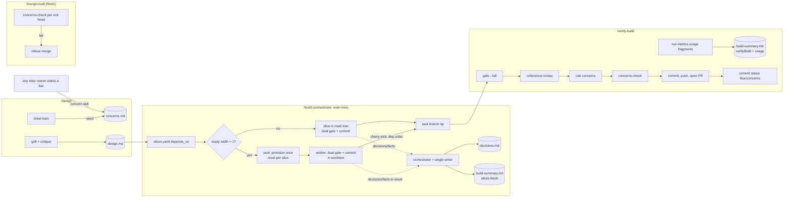

# Design — XL-27: a committed per-work-item record (design, decisions, concerns, build summary)

> **Grounding degraded: this repo has no `CONTEXT.md`.** Grounding fell back to `docs/adr/` (ADR-001…004)
> and the command/agent bodies, which in this repo are the source. **Recommend `/seed-context`.**
> Run without a lane brief (no `.work/lane.yaml`): a single interactive `/design`. No `.esas/` → no board.
>
> Ticket: [XL-27](https://teselly.atlassian.net/browse/XL-27) (parent XL-42). Target repo: `bett3r-ai-workflow`.
> Base: `e6283b7` on `evolve/design-multi-write-contract`. Prior `.work/design.md` (#268) preserved as
> `.work/design-268.backup.md`.
>
> **Scope note.** The operator folded in, explicitly, what was first proposed as a spin-off:
> parallel slice execution in `/build` via a reusable worktree pool. It lands in this unit.

## Problem & intent

The flow throws away its richest per-work-item knowledge **by rule**:

- `build.md:187` — *"No `build-progress.md`, no `build-summary.md`. The commits and `passes` flags are the truth."*
- `verify-build.md:107` — the design *"become[s] the **PR description** — they are *not* committed as a standalone doc"*; `.work/` is discarded (`verify-build.md:181`).
- Plugin README principle, since the plugin's third commit (`62b4f85`, 2026-06-19, no ADR): *"Git is the system of record … Nothing else is kept."*

Measured effect (teselly): new `docs/prs/` folders 55/37/51/41 (Mar–Jun) → 15/13/0 (Jul–Sep). PR bodies did
not absorb the content (last three: 728–2,990 B, no forks or rejected options).

**Premise check — "the store already captures `.work/`" does not rescue it.** `xp-capture`'s `.work` rules do
KEEP `design*.md` (`glob/design`, `bett3r-xp-layer/packages/xp-capture/src/rules.ts`), but the hooks are inert
without an executable `.xp-layer/capture`, and **neither `teselly/` nor `esas/` has one** (`ls` → no such
file). Nothing captures these artifacts anywhere today.

**Intent.** Every work item leaves a committed folder holding four artifacts — one copy each, no mirror in
`.work/`:

| Artifact | What it is | Reader |
|---|---|---|
| `design.md` | the design as resolved: forks, chosen answers, rejected options | humans, `/plan`, `/build`, experience layer (knowledge) |
| `decisions.md` | **append-only log of decisions made after the design** | experience layer (knowledge), process measurement |
| `concerns.md` | owner-stated bars, with attribution, verified at landing | `/verify-build`, `concerns-check`, experience layer |
| `build-summary.md` | **telemetry**: YAML frontmatter measurement + short prose | experience layer (metrics ingest, not knowledge) |

Working state stays in gitignored `.work/`: `slices.yaml` (the plugin's tickets + progress), `mode.yaml`,
`lane.yaml`, `learnings.md`, `handoff/`, `known-baseline-failures.md`.

And `/build` gains **parallel execution of independent slices** in reusable worktrees.

## The resolved decision tree

### F1 — One copy per artifact, committed
**Chosen:** `/design` writes and commits `<root>/<id>/design.md` directly; every reader moves to that path.
**Why:** a `.work/` path is unreachable from any other base (`/design` Step 5's own rule); an abandoned
unit's design — rejected options included — survives on its branch; amendments are diffs.
**Rejected:** promote at `/verify-build` only (dead citations mid-run, lost on abandon); promote at both
ends (two copies, nothing checks they agree).
**Cost accepted:** 26 references across 10 plugin files move (`grep -rho '\.work/design\.md' plugins/bett3r-ai-workflow | wc -l`).

### F2 — `decisions.md` is the post-design log, with a fixed countable header
**Chosen:** `design.md` keeps the tree as resolved; every later deviation, filled silent seam, false
premise, knowingly-shipped finding, or overrule appends an entry. Kept **because it measures `/design`**:
entries per work item, grouped by plugin version, is a design-to-build drift rate `run-metrics` cannot see.

```markdown
## D1 — <one-line decision>
kind: silent-seam        # false-premise | silent-seam | deviation | shipped-finding | overruled | waiver
step: build · slice: 2 · decidedBy: executor    # executor | verifier | orchestrator | lane | human
sources: [code:<symbol> (<file>), adr:ADR-NNN, design:<section>, xp:<atom-id>, human]
rejected: <option> — <why not>
supersedes: —            # set when this overturns an earlier entry
<prose: why>
```

**Rules:** record what was **consulted** (`sources`), never a self-rated confidence (uncalibrated, not
comparable across models); "how good" is measured by outcome (`supersedes`). Ids are allocated by the
single writer (see F6). Zero entries is stated explicitly in `build-summary.md` (`postDesignDecisions: []`),
so an absent log is never read as zero.
**Rejected:** `decisions.md` as the only record (strips `design.md`); amend `design.md` in place (the fact
of change lives only in `git log -p`).

### F3 — `build-summary.md`: `/build` writes, `/verify-build` completes; it is telemetry
**Chosen:** markdown with YAML frontmatter (shape below). `/build` writes and commits the `slices` block
when it ends, green **or partial**; `/verify-build` fills `verifyBuild` and the generated `usage` blocks
before opening the PR.
**Format constraint (verified):** a `.yaml` file never reaches the store — `junk/yaml` drops `*.{yaml,yml}`
and the shape stage is markdown-only (`classify`, `bett3r-xp-layer/packages/xp-backfill/src/rules.ts`).
**Generated, never hand-written:** usage (tokens, active time, model, effort) comes from `run-metrics`,
which already reconstructs per-role models/efforts and a per-slice retry ledger from transcripts
(`retryLedger`, `run-metrics.mjs:576`). An agent cannot observe its own usage.

```markdown
---
workItem: XL-27
plugin: bett3r-ai-workflow@0.66.0+<sha>
base: <sha>
slices:
  - id: 1
    name: <name>
    origin: plan                     # plan | verify-build (fix slice)
    mode: sequential                 # sequential | worktree   (F6)
    commit: <landed sha>
    passed: true
    attempts: 1                      # executor passes; 1 = first-pass green
    retries: []                      # classified, per build.md "Every retry is classified"
    verifier: pass
    redBeforeGreen: true             # or: mutation
    postDesignDecisions: [D1]        # ids into decisions.md; [] = explicitly none
    usage:                           # GENERATED by run-metrics
      executor:   { model: ..., effort: ..., tokens: ..., activeMs: ... }
      verifier:   { model: ..., effort: ..., tokens: ..., activeMs: ... }
      testRunner: { model: ..., effort: ..., tokens: ..., activeMs: ... }
verifyBuild:
  gate: { mode: full, verdict: PASS, skipped: [], inconclusive: [] }
  coherence: { critical: 0, medium: 0, low: 0, shippedUnresolved: [] }
  concerns: { hard: 0, soft: 0, unmet: [] }
  fixSlicesAdded: 0
  adrs: []
  usage: { model: ..., effort: ..., tokens: ..., activeMs: ... }   # GENERATED
---
## What shipped
<short prose: outcome, measured root causes, what a future agent should know>
```

**Measure before the PR (F3b).** `run-metrics --emit` moves ahead of `/verify-build` Step 6; its output
fills the frontmatter, which is committed, then the branch is pushed and the PR opened.
**Minimal generator in scope:** `run-metrics` gains an output mode that prints the per-slice and
verify-build `usage` fragments. **Attribution hardening in scope:** every `/build` dispatch description
names its slice (`slice <id>`), because `retryLedger` attributes by regex over the description
(`run-metrics.mjs:582`) and anything else is `unattributed`.
**Rejected:** `/verify-build` writes it all (partial builds leave nothing; `/build`'s facts die with its
context); `/build` writes it all (gate and review never reach the record); post-PR extra commit; usage
kept only in `~/.claude/bett3r-metrics` (one machine, invisible to the store).

### F4 — Concerns: a `concern` skill; `concerns-check`; a GitHub commit status; the hard block is in `/merge-multi`
**Capture.** New skill `concern`, model-invoked the moment an owner states a bar (as `record` is), from
any step; `/design` Step 1 also seeds concerns from explicit bars in the ticket. Writes
`<root>/<id>/concerns.md` directly.

```markdown
## C1 — <label>
bar: hard                # hard | soft
raisedBy: ticket owner · step: design
quote: "<verbatim>"
why: <why it matters>
verify: <how to verify at /verify-build>
verdict: —               # met | partial | unmet | cannot-determine | waived — set by /verify-build
evidence: —
```

**Check.** New `bin/concerns-check` (precedent: `bin/resolved-marker-lint` + `scripts/*.py`). Fails when any
concern lacks a verdict, or any `bar: hard` concern is `unmet | partial | cannot-determine` (**fail closed**).
Prints a verdict line the step reads (ADR-004), not an exit code alone.
**Waiver:** only the owner; `verdict: waived` requires the verbatim quote and appends a `decisions.md`
entry (`kind: waiver`, `decidedBy: human`).
**`/verify-build`:** new step rules every concern with evidence, runs `concerns-check`, **opens the PR
either way**, and posts a commit status on the head sha:

```sh
gh api repos/{owner}/{repo}/statuses/<head-sha> -f context=flow/concerns \
  -f state=<failure|success> -f description="<n hard concerns unmet: C1, C3>" \
  -f target_url=<blob URL of concerns.md on the branch>
```

Unmet hard concerns get a PR-body section. The flow re-posts on every push it makes.
**Where it blocks (verified constraint):** teselly is private on the free plan — branch protection and
rulesets return *"Upgrade to GitHub Pro or make this repository public"* — so a status cannot be
*required*; the red ✗ is advisory in a single flow. **`/merge-multi` is the hard block:** it runs
`concerns-check` itself on each unit head and refuses to merge a failure (it does not trust the GitHub
status alone — see Critique fold-in C2).
**No GitHub App needed** (commit statuses need only `repo` scope, which the token has). Check Runs
(annotations, re-run) would need an App — possible later, not now. Not Actions: no workflow, no minutes.
**Rejected:** capture only inside `/design` (mid-build bars are lost); no file, concerns as ACs (loses
speaker attribution — the one thing the store cannot otherwise express); refuse to open the PR (operator
preferred an opened PR with a red mark).
**Fixes a dangling reference:** `skills/record/SKILL.md` says a concern is *"consumed by `/verify-build`"*;
today nothing does.

### F5 — Fleets: each lane writes its own folder on its unit branch
**Chosen:** a lane's `/design`, `/build`, `/verify-build` write `<root>/<id>/` on the unit branch, exactly
as a single flow. Run-level `decisions.md` (`/design-multi` Phase B cross-cutting policies, `/merge-multi`
conflict resolutions — already required by `merge-multi.md:59`) is written by `/merge-multi` to
`<root>/<epic-id>/` (or `<root>/<run-id>/` with no epic).
**Documented limitation, not engineered:** a sibling lane cannot cite another lane's design until merge.
**Why minimal:** the operator's direction is that a task-with-subtasks (one PR, parallel slices — F6) is
the epic model, so fleets matter less. **No separate remote command set** — local vs. remote stays
expressed as brief keys (e.g. `gateDeferred: true`), per `remote-ai-agents/docs/architecture.md` §6
("obey **one** definition") and its RESET evidence (TV1-2423 → PR #534 on unchanged commands).
**Rejected:** `/start-multi` seeds `int/<run-id>` (adds machinery to a path being de-emphasised);
`/design-multi` PRs designs to default (invalidates its own pin, `design-multi.md:124`).

### F6 — Parallel slices always in worktrees, from a reusable pool
**Grounded gap:** `/build` today *may* dispatch independent executors concurrently **in one tree**, commits
one at a time, *"When unsure, go sequential"* (`build.md:30`); `touches` is *"an optional hint only"*
(`plan.md:58`). A shared tree is unsafe beyond file overlap: whole-repo build output, half-written files
seen by another typecheck, generators and lockfile, the git index.
**Chosen (operator):** slices with no unmet `depends_on` that run concurrently each run in their own
worktree. Sequential slices keep running in the main tree.

- **Pool size, computed up front:** `min(width of the depends_on DAG, --max-parallel, worktreePoolMax)`.
  Width = the most slices ready at the same moment. Width 1 → no pool.
- **Disk cap is a brief key, set by the venue (operator decision).** `.work/lane.yaml` key
  `worktreePoolMax`. A dispatch to **Anthropic cloud runners writes `worktreePoolMax: 4`** (30 GB VM).
  **Internal workers and local runs write nothing → no cap** beyond `--max-parallel`. Same mechanism as
  `gateDeferred: true`: one command set, the venue expressed as a key.
- **The mechanics are a script, not prose** (so the pool is tested, not gate-less). New
  `bin/worktree-pool` (+ `scripts/worktree-pool.py`), with subcommands that each print a verdict line
  (ADR-004), never an exit code alone:
  - `size <slices.yaml> [--max-parallel N] [--pool-max N]` → DAG width and the pool size.
  - `provision <n>` → creates the worktrees; install/build are **the host repo's commands**, passed in (the
    script hardcodes no package manager).
  - `reset <worktree> <tip>` → `switch --detach <tip>`, `clean -fd`, then install + build, unconditionally.
  - `land <worktree> <sha>` → cherry-pick onto the task branch; on conflict aborts the cherry-pick, leaves the
    branch untouched, and reports `conflict` with the paths.
  - `teardown` → removes pool worktrees; **refuses** while any worktree holds a commit not on the task branch.
  `/build` keeps the judgment (dispatch, dependency order, escalation); the script owns the git mechanics.
- **Provision once, at the start of `/build`,** serially (concurrent cold builds contend on 4 vCPU), never
  overlapping a gate. Reuse the existing `provisioner` agent.
- **Reuse, never recreate.** Before a worktree takes its next slice: `git switch --detach <task-branch tip>`
  → `git clean -fd` (keeps ignored `node_modules`) → install → build, **unconditionally**. Source:
  `remote-ai-agents` D6 — a reused tree *"inherits stale `.tsbuildinfo`, stray compiled `.js` shadowing
  sources"*; *"staleness costs time, never correctness."* Incremental install/build is far cheaper than
  cold (~400 s for the three-repo layout; COW `node_modules` unavailable on overlayfs/ext4).
- **Each slice runs its full dual gate in its worktree** (executor → test → verifier → scope-check), commits
  there; the orchestrator **cherry-picks onto the task branch in dependency order**. A dependent slice
  starts only after its parent's commit landed (the reset takes the tip). A cherry-pick conflict stops that
  slice and escalates.
- **Single writer for the record** (Critique fold-in C1): workers never write `decisions.md` or
  `build-summary.md`; they report decisions and facts in their result, and the orchestrator appends them
  in the main tree at landing, allocating `D` ids. `slices.yaml` records the **landed** sha.
- **Teardown** at the end of `/build`, only after every commit landed.

**Rejected:** same-tree parallelism with gates serialised (operator chose the always-safe option);
disjoint `touches` with concurrent gates (collisions); planner judges "no chance of conflict" (unverifiable).

### F7 — `docs/prs/<id>/` by default, overridable; id normalisation
**Chosen:** root = `docs/prs` unless `.claude/bett3r-ai-workflow.json` sets `{"workDocsRoot": "<path>"}` —
one key, read by a command, never inferred from prose. Id:

| work item | folder |
|---|---|
| Jira key `TV1-2400` | `TV1-2400/` |
| GitHub issue `#268` | `gh-268/` |
| no id | `<yyyy-mm-dd>-<slug>/` |

**Why:** teselly/esas/pv3 already use `docs/prs/` (212/3/16 folders), and the store's corpus rules treat
the first segment as the ticket (`classify`, `xp-backfill/src/rules.ts`) — zero store change;
`remote-ai-agents` has its own convention (*"do **not** start a `docs/adr/` directory"*), so the plugin must
not impose one. `.esas.config.json` rejected as the home: ADR-003's store/consumer-agnostic invariant.
**Rejected:** fixed path (breaks project-agnosticism); required config (every repo stops at first `/design`).

### Resolved without a fork
- **PR body** becomes a short summary + links to the four files; keeps Slices, Verification, Run cost.
- **Not committed:** `build-progress.md`, `tickets.yaml` equivalents stay as `.work/slices.yaml`.
- **Release:** minor bump `0.65.0 → 0.66.0` (ADR-001; payload changes).
- **README principles** ("Nothing else is kept", "No committed `sdd.md`…") and `verify-build` Principle
  (*"invest in its body, not in committed scratch docs"*) are rewritten — they state the reversed rule.

## Seams / flow



New boundaries crossed: GitHub commit status API (write, `repo` scope); worktree lifecycle inside `/build`.
Cross-repo, not changed here: xp-layer ingestion (follow-up), teselly rules (follow-up).

## Test seams

Prefer the existing oracles; mirror their prior art.

1. **`scripts/test-flow-seams.sh`** (presence oracle over command text; prior art: its `[SEAM n]` and
   `LANE-STEP` assertions). Add assertions that survive only if the rules survive:
   - `/design` writes `design.md` under the work-docs root, commits it; no `.work/design.md` reader remains
     (negative: `grep -rn '\.work/design\.md' plugins/bett3r-ai-workflow` → 0; no fallback reader).
   - `build.md` no longer carries *"no `build-summary.md`"*; carries the single-writer rule and the worktree
     reset sequence (`git clean -fd`, install, build *unconditionally*).
   - `verify-build.md`: `run-metrics` precedes Step 6; `concerns-check` runs; `flow/concerns` status posted.
   - `merge-multi.md`: runs `concerns-check` per unit and refuses on failure.
   - `skills/record/SKILL.md`'s concern reference resolves to the `concern` skill.
2. **`concerns-check` fixtures** under `scripts/fixtures/concerns/` (prior art: `scripts/fixtures/lane-step/`
   driven from `test-flow-seams.sh`). Cases: all met → pass; hard unmet / partial / cannot-determine → fail;
   soft unmet → pass + named; missing verdict → fail; `waived` without quote → fail; malformed entry → fail
   loudly, never pass.
3. **`scripts/test-run-metrics.sh`** (new — operator-approved). Transcript fixture (two slices,
   executor/verifier/test-runner dispatches named `slice 1` / `slice 2`); asserts the emitted usage
   fragment's per-slice attribution, and that an un-named dispatch lands in `unattributed`.
3b. **`scripts/test-worktree-pool.sh`** (new). Builds a throwaway git repo in `mktemp -d` (prior art: the
   temp-dir + `pass`/`fail` harness in `test-flow-seams.sh`); install/build are stub commands that write a
   marker file, so the test proves they ran *unconditionally*. Cases:
   - `size`: a DAG of widths 1, 2 and 3 → pool 0/2/3; `--pool-max 4` caps a width-6 DAG to 4; no
     `--pool-max` → uncapped (only `--max-parallel`).
   - `reset`: worktree ends detached at the tip; a stray untracked file is gone; an ignored `node_modules/`
     survives; install and build markers are written even when nothing changed.
   - `land`: two independent commits land in dependency order and the branch holds both; a conflicting
     commit reports `conflict` with the path, the cherry-pick is aborted, and the branch tip is unchanged.
   - a dependent slice's reset takes the tip *after* its parent landed (parent's file present).
   - `teardown`: refuses while a worktree holds an unlanded commit; succeeds after landing.
   - verdict lines parse; a wrapper swallowing the exit code cannot turn a `conflict` into a pass.
   - `build.md` presence: `/build` calls `worktree-pool` for size/reset/land/teardown (in `test-flow-seams.sh`).
4. **`scripts/check-artifact-links.py`** already gates links in plugin markdown — the new skill and doc
   links must resolve (existing gate, no change).
5. **`scripts/check-plugin-version-bump.sh`** — the bump (existing gate).

The pool's git mechanics are executed by 3b; what no suite can execute is an agent *choosing* to call the
script at the right moment — see R2.

## Risks / the gate-less seam

- **R2 (tracer bullet) — the pool's orchestration is the residual gate-less seam.** `worktree-pool` is
  tested (3b); the untested part is `/build`'s judgment around it: dispatching workers into the right
  worktree, waiting for a parent's landing, the single-writer record. **Tracer bullet:** slice 1 ships
  `worktree-pool` + `test-worktree-pool.sh` RED→GREEN, then proves the orchestration on one real
  two-independent-slice plan in a scratch repo: pool size computed, one reuse cycle, both commits landed
  with `slices.yaml` holding landed shas, `decisions.md` written once. If the land/reset seam does not hold,
  stop before building the rest on it.
- **R3 — accepted by design (operator).** Slices run in parallel are never gated together until
  `/verify-build`'s `--full`. This is the design, not a defect.
- **Resolved by operator, no longer risks:** in-flight branches on upgrade (not an issue — **no
  `.work/design.md` fallback**); disk cap (`worktreePoolMax: 4` on Anthropic runners, uncapped internally);
  cross-repo follow-ups (non-blocking for this unit).
- **R5 — advisory status in private repos.** A human can merge over `flow/concerns` = failure in a single
  flow; a human push without re-running leaves the head with no status (looks clean). Stated in
  `/verify-build`, not hidden.
- **R6 — telemetry extracted as knowledge.** Until the xp-layer follow-up lands, `shape/build-summary`
  (`xp-backfill/src/rules.ts`) rules `build-summary*` **extract**: frontmatter numbers would become atoms.
- **R7 — `run-metrics` transcript resolution for worktree workers** is unverified (workers run with a
  different cwd). The run-metrics slice verifies it against a real pool run before the usage fragment is
  trusted.

## Critique (arch, ops) — folded in

- **C1 (Critical, folded):** parallel workers appending to `decisions.md` / `build-summary.md` would conflict
  on *every* cherry-pick. → single-writer orchestrator (F6).
- **C2 (Medium, folded):** `/merge-multi` blocking on a GitHub status makes the block depend on a post that
  can fail (auth, non-GitHub remote). → `/merge-multi` runs `concerns-check` itself; the status is display.
- **C3 (Medium, dismissed by operator):** upgrade strands in-flight designs → not an issue; no fallback.
- **C6 (Medium, folded):** the pool as prose was untestable. → mechanics moved into `bin/worktree-pool`,
  tested by `test-worktree-pool.sh`.
- **C4 (Low, carried):** commit noise — a design commit per `/design` pass. Accepted; the diff is the value.
- **C5 (Low, carried):** `concerns-check` parses markdown fields — brittle to reformatting. Mitigated by
  fail-loud on malformed entries (fixture), never a silent pass.

## Unspecified seams (deliberately not decided — non-guidance)

- **Status re-post on human pushes.** The flow re-posts on its own pushes; nothing re-posts on a human's.
  Adjacent to a specified rule — do not invent a git hook to cover it.
- **Which component writes `worktreePoolMax: 4`** on an Anthropic-runner dispatch — the remote scheduler
  (`remote-ai-agents`) owns writing brief keys; this unit only reads the key.
- **`D` / `C` id allocation across a fleet's run-level `decisions.md`** vs. per-unit logs — ids are
  per-file; cross-file references use `<id>/D<n>`.
- **A `concern` raised in `/plan` or `/merge-multi`** — the skill works from any step; which step label
  those use is not enumerated.
- **Re-running `/build` after partial completion with a pool** — resume semantics reuse the existing
  idempotent `passes:` rule; pool re-provisioning on resume is not specified beyond "reset before use".
- **What `run-metrics` emits for fleet lanes** (per-unit vs. per-run fragments).
- **Jira sub-tasks as `/plan` input** (operator: the direction "naturally flips"). Not specified here;
  `/plan --publish` continues to create sub-tasks from slices.

## Scope boundaries

**In (this unit, one PR, `bett3r-ai-workflow`):**
- `commands/design.md`, `plan.md`, `build.md`, `verify-build.md`, `merge-multi.md`, `start-multi.md`
  (limitation note), `agents/verifier.md`, `skills/critique`, `skills/handoff`, `skills/handon`,
  `skills/esas-design/*`, `README.md` — the 26 `.work/design.md` references and the reversed principles.
- New `skills/concern/SKILL.md`; fix `skills/record/SKILL.md`.
- New `bin/concerns-check` + `scripts/concerns-check.py` + fixtures.
- `scripts/run-metrics.mjs` usage-fragment output; dispatch-description attribution rule in `build.md`.
- Worktree pool in `/build` (reusing `agents/provisioner.md`); new `bin/worktree-pool` +
  `scripts/worktree-pool.py`; `worktreePoolMax` brief key read by `/build`.
- New `scripts/test-worktree-pool.sh`, `scripts/test-run-metrics.sh`.
- `.claude/bett3r-ai-workflow.json` `workDocsRoot` resolution rule.
- `scripts/test-flow-seams.sh` assertions; `plugin.json` → `0.66.0`.
- **ADR-005** (next free number; `git log --all --name-only --pretty=format: | grep -oE 'ADR-[0-9]+' | sort -u | tail -3` → ADR-004).

**Out — follow-ups in other repos (not this plugin):**
- **bett3r-xp-layer:** route `build-summary.md` to a metrics ingest instead of `shape/build-summary` extract
  (R6); later, a `run-report --aggregate`-style consumer counting `decisions.md` entries by `kind` per
  plugin version.
- **teselly:** `.claude/rules/README.md:41` (*"`docs/prs/` … remain as history only"*) and
  `.claude/commands/diagnose.md:171` become stale — update.
- **Later, optional:** a GitHub App for Check Runs; a purpose-built metrics tool replacing the
  `run-metrics` fragment mode.

## Deltas (specified, written during build)

- **ADR-005 — "A work item's record is committed beside the code, not only in the PR body."** Records: the
  reversal of the founding "Nothing else is kept" principle (no prior ADR; `62b4f85`); the measured folder
  collapse; the unrealised store-capture premise; the four artifacts and their readers (knowledge vs.
  telemetry); single copy; `decisions.md` as post-design measurement; concerns + advisory status + the
  `/merge-multi` hard block and the private-repo constraint; the worktree pool and the
  `worktreePoolMax` venue key.
- **README Core principles** rewritten to match.
- **Glossary:** none (no `CONTEXT.md`). Terms to seed via `/seed-context`: *work-docs root*,
  *post-design decision*, *concern (hard/soft bar)*, *worktree pool*, *single writer*.

## Provenance

```sh
# ticket history (none shipped)
git log --oneline --all --grep=XL-27                                   # → empty
# cited lines
grep -n '' plugins/bett3r-ai-workflow/commands/build.md | sed -n 187p
grep -n '' plugins/bett3r-ai-workflow/commands/verify-build.md | sed -n 107p
# founding principle, no ADR
git log --oneline -S"Nothing else is kept" -- plugins                  # → 62b4f85
# reference count to migrate
grep -rho '\.work/design\.md' plugins/bett3r-ai-workflow | wc -l       # → 26 (10 files: grep -rln)
# store capture adapters absent
ls ../teselly/.xp-layer ../esas/.xp-layer                              # → No such file or directory
# teselly corpus
ls ../teselly/docs/prs | wc -l                                         # → 212
for n in build-summary.md concerns.md context.md sdd.md decisions.md; do ls -d ../teselly/docs/prs/*/$n | wc -l; done
                                                                       # → 167 28 192 162 30
# store rules: yaml dropped, shape stage markdown-only
sed -n 280,380p ../bett3r-xp-layer/packages/xp-backfill/src/rules.ts
# run-metrics already measures per-role model/effort and per-slice ledger
/usr/bin/grep -n -E 'retryLedger|efforts' plugins/bett3r-ai-workflow/scripts/run-metrics.mjs   # file is flagged binary: use /usr/bin/grep -a if needed
# slice parallelism today
sed -n 28,32p plugins/bett3r-ai-workflow/commands/build.md
grep -n touches plugins/bett3r-ai-workflow/commands/plan.md
# GitHub capability
gh auth status                                                         # scopes include repo
gh api repos/bett3r-dev/teselly/branches/master/protection             # 403 Upgrade to GitHub Pro
gh api repos/bett3r-dev/teselly/rulesets                               # 403 Upgrade to GitHub Pro
# remote constraints
sed -n 51,60p ../remote-ai-agents/docs/decisions.md                    # D6 unconditional fetch→install→build
sed -n 138,146p ../remote-ai-agents/docs/environment-findings.md       # ~400 s cold build
sed -n 207,227p ../remote-ai-agents/docs/architecture.md               # §6 one definition
# no oracle pins the changed sentences
grep -n 'present "\$\(VERIFY_BUILD_MD\|DESIGN_MD\|BUILD_MD\|START_MD\)"' scripts/test-flow-seams.sh
# ADR number
git log --all --name-only --pretty=format: | grep -oE 'ADR-[0-9]+' | sort -u | tail -3   # → ADR-004
```

Session: operator interview 2026-09-12 10:28–11:56 -03 (forks F1–F7 as recorded above).
