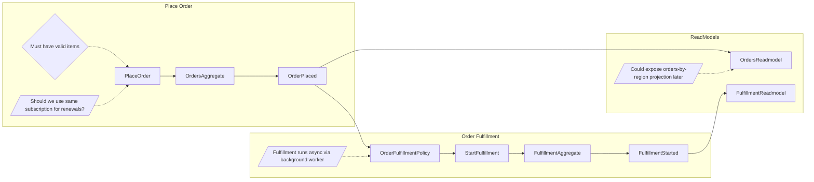

# Skill: Miro to Mermaid

Extract event-storming artifacts from a Miro board frame and convert them into structured Mermaid flowcharts.

## Inputs

The skill takes **two** inputs that must be provided together — they cover complementary parts of the frame:

1. **Frame URL** — e.g. `https://miro.com/app/board/<boardId>=/?moveToWidget=<frameId>`
   - Used by the bundled Miro frame-data fetcher (Step 1) to fetch items the Miro API exposes (sticky notes, shapes, cards, connectors) with reliable IDs, types, colors, and bounding boxes.

2. **Frame SVG export** — a `.svg` file the user manually exports from Miro (right-click frame → Export selection → SVG).
   - Used to recover items the API does **not** expose: **callouts** and **code blocks**. The SVG also contains every connector with explicit endpoint coordinates.

Both sources are merged on bounding-box geometry. If the user provides only one, ask for the other before proceeding.

## Rationale for Two Sources

Miro's REST API does not return callout or code-block content. The SVG export, however, preserves them as vector `<text>` nodes with absolute coordinates. Conversely, the API gives canonical IDs, sticky colors, and card metadata that are awkward to recover from the SVG. Using both is strictly more reliable than either alone.

## Process

### Step 1: Fetch & merge frame data (bundled CLI)

Use the **bundled Miro fetcher** that ships with this plugin at `scripts/miro-cli/` — resolve the plugin root (if `$CLAUDE_PLUGIN_ROOT` is set, it is `$CLAUDE_PLUGIN_ROOT/scripts/miro-cli/`; otherwise it is the `scripts/miro-cli/` directory of the installed `bett3r-pv3-ai-skills` plugin — the same plugin this skill ships in).

First-time setup (once): in that directory run `npm install`. Provide your Miro token via the `MIRO_ACCESS_TOKEN` environment variable — recommended is an exported shell var (e.g. `export MIRO_ACCESS_TOKEN=...` in `~/.zshrc`), since it's a personal credential, works regardless of where the script runs, and survives plugin updates; a `.env` file (in the run dir or beside the script) is an optional fallback. The token needs the `boards:read` scope. See `scripts/miro-cli/README.md`.

Then run it with **both** inputs — the frame URL and the SVG export:

```bash
npm run frame -- "<frame-url>" --svg <path-to-frame.svg> --pretty
```

The CLI prints JSON on stdout with three keys: `items`, `connectors`, `metadata`. Each `item` carries `id`, `type`, `text`, `color`, `x`, `y`, `width`, `height` — and, crucially, the CLI has **already parsed the SVG and merged in** the callouts (`item.callouts`), the code-block data structures (`item.dataStructure`), and validated the connectors. In other words **the bundled CLI performs Steps 2–3 below for you**: when you use it, read its merged `items`/`connectors` and skip straight to Step 4. (Steps 2–3 document what the CLI does, and are the manual fallback for a fetcher that returns only raw Miro API data. If your repo already provides its own fetcher, you can use that instead.)

### Step 2: Parse SVG

> **Using the bundled CLI (Step 1)?** It already does Steps 2–3 — skip to Step 4. The following documents the CLI's behavior, and is the manual fallback when your fetcher returns only raw Miro API data.

Parse the SVG file and extract:

- **Callouts** — `<g>` groups whose `<path>` style contains a callout stroke color (see below). Concatenate child `<text>` content. Compute bbox from the parent `transform="translate(x, y) scale(s)"` and the group's `width`/`height` attributes. Compute the **tail tip** by reading the long descender vertex in the callout `<path>` (it's the only point outside the rounded-rectangle body).
- **Code blocks** — `<g>` groups containing an inner `<svg>` whose `rect` `fill="#050038"` (dark navy). Concatenate child `<text>` content, preserving order; the result is the data-structure definition. Compute bbox from the parent transform.
- **Connectors with endpoints** — `<g>` groups containing `LineHeadArrow*` references plus a `<path>`. Extract the path's start and end points and add the transform translation to get absolute coords. Arrowhead direction tells you which end is the target.

### Step 3: Merge by Geometry

- For each API connector, look up its `startItem.id` / `endItem.id` directly — no geometry needed.
- For each SVG callout, do **point-in-bbox** with the callout's tail tip against API item bboxes. The bbox that contains the tip is the callout's target.
- For each SVG code block, find the connector (API or SVG) whose endpoint coincides with the code block's bbox edge. The other end of that connector is the sticky the code block annotates.
- For SVG-only connectors (touching code blocks/callouts), match both endpoints to bboxes from either source.

### Step 4: Identify DDD Components

**Sticky notes** (from API, by `style.fillColor`):

| Color | Component | Mermaid Node |
|------|-----------|-------------|
| `blue` | Command | `cmd[CommandName]` |
| `orange` | Event | `evt[EventName]` |
| `light_yellow` | Aggregate | `agg[AggregateName]` |
| `violet` | Policy | `pol[PolicyName]` |
| `light_green` | Read Model | `rm[ReadModelName]` |
| `gray` | External System / UI | `ext[SystemName]` or `ui[ScreenName]` |

**Cards** (from API): Non-black cards are **Invariants** — `inv{InvariantDescription}`. (Black cards as data structures are deprecated — see below.)

**Code blocks** (from SVG): represent **data structures / data types** attached to a sticky via connector. They replace the previous "black card" convention. The code block's text content is the structure definition (e.g. `{ foo: 'bar' }`, TypeScript-like shapes, or JSON Schema fragments). Associate each code block with its connected sticky and emit it under that sticky's `dataStructure` field — same shape the old card-based flow produced.

**Callouts** (from SVG, by stroke color on the bubble `<path>`):

| Stroke color | Semantic | Mermaid Node |
|---|---|---|
| Red (`#ff6464` / red family) | **Hot spot / question / problem** — things that need answering or further discussion | `hot[/Hot spot text/]` |
| Blue (Miro blue family) | **Comment / information** — things to be aware of | `info[/Info text/]` |
| Green (Miro green family) | **Idea / opportunity** — things to explore going forward | `idea[/Idea text/]` |

Callouts attach to the API item whose bbox contains the callout's tail tip.

### Step 5: Detect Flows

1. **Process connectors FIRST** — both API connectors and SVG connectors. They are authoritative.
2. **Then use positioning** — group by Y-coordinate proximity, order by X-coordinate.
3. **Invariant anchoring** — use X-coordinates ONLY (never text/tags) to associate invariants with their commands.

### Step 6: Generate Mermaid

Output structured Mermaid flowcharts. Render callouts as side notes attached to their target, and data structures as code-fenced blocks under the captured-structures section (not inside the flowchart):



### Step 7: Capture Structures

```
## Captured Structures

Commands: PlaceOrder, StartFulfillment
Events: OrderPlaced, FulfillmentStarted
Aggregates: OrdersAggregate, FulfillmentAggregate
Invariants: {"Must have valid items" -> PlaceOrder, ERROR: INVALID_ITEMS}
Policies: OrderFulfillmentPolicy (OrderPlaced -> StartFulfillment)
ReadModels: OrdersReadmodel (subscribes: OrderPlaced), FulfillmentReadmodel (subscribes: FulfillmentStarted)

DataStructures:
  OrderPlaced:
    ```
    {
      orderId: string,
      items: OrderItem[]
    }
    ```

HotSpots:
  - "Should we use same subscription for renewals?" -> PlaceOrder
Info:
  - "Fulfillment runs async via background worker" -> OrderFulfillmentPolicy
Ideas:
  - "Could expose orders-by-region projection later" -> OrdersReadmodel
```

### Step 8: Notes

```
## Notes

- Invariant "Must have valid items" associated with PlaceOrder based on X-coordinate proximity
- Callout tail tip at (500, 693) fell inside OrdersAggregate bbox — attached there
- Code block at (1375, 401) linked to OrderPlaced via SVG connector
```

## Output Format

Save to your active work directory (e.g. `.work/mermaid-output.md`) if one exists. Otherwise, present directly to the user.

```markdown
# Miro to Mermaid: [Board/Frame Name]

## Flows

[Mermaid flowcharts]

## Captured Structures

[Structured data + DataStructures + HotSpots/Info/Ideas]

## Notes

[Observations and decisions]
```

## Critical Constraints

- **Both inputs required** — frame URL AND SVG file. Don't proceed with only one.
- **Process connectors FIRST** before positioning inference. API connectors and SVG connectors are both authoritative.
- **Code blocks replace black cards** for data structures. Do not treat black cards as data structures anymore — if the board still has them, flag in Notes and ask the user to migrate.
- **Callout color → semantic mapping is fixed** (red=hot spot, blue=info, green=idea). Don't infer semantics from text.
- **Callout target detection uses tail-tip point-in-bbox** — the tail tip is the long descender vertex in the callout path, not the bubble center.
- **Invariant anchoring uses X-coordinates ONLY** — never text/tags.
- **Fan-out events stay in same flow** — don't split into separate flows.
- **One line per structure** in Captured Structures format.
- **Preserve original names** from the board — don't rename components.
- **Flag ambiguities** in Notes — don't silently guess.

## Final Checklist

- [ ] Both frame URL and SVG were provided and parsed
- [ ] All API items processed (none missed)
- [ ] All SVG callouts and code blocks extracted
- [ ] Connectors processed before position inference
- [ ] Callouts attached via tail-tip point-in-bbox
- [ ] Code blocks attached to their sticky via connector and emitted as `DataStructures`
- [ ] Callouts classified by stroke color (red/blue/green)
- [ ] Invariants anchored to correct commands
- [ ] Flows are left-to-right (command → aggregate → event)
- [ ] Policies connect event → policy → command
- [ ] Read models subscribe to correct events
- [ ] Captured Structures has all components including HotSpots/Info/Ideas
- [ ] Ambiguities documented in Notes
